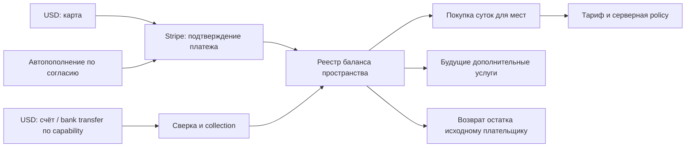

# ADR-0080: USD-баланс и суточные места — Stripe, затем RUB / Точка

Дата: 2026-10-09. Статус: **v5 — принят срез v1 (ниже); реальные платежи выключены**.
RU / Точка и выбор рынка до первой оплаты — [ADR-0083](0083-tochka-ru-billing.md) (уточняет §2.1, §6, §9, §11.2, §13).
Страновые реквизиты плательщика — поправка §0.1 (2026-10-10, отменяет их вырезку из v1).
База исследования: `8fdf1b9d907de88173dd8e6c82950bb75bc082df` (3.0.3).
План поставок: [billing-v1-tasks](../plans/billing-v1-tasks.md) (задачи T0–T9 и их пути);
исходный план v4.1: [balance-billing-v1](../plans/balance-billing-v1.md).
Детальные контракты: [счета/плательщики/админка](../plans/billing-invoices-and-payers.md),
[FIFO/масштабирование](../plans/billing-fifo-and-scale.md),
[Stripe v1](../plans/billing-stripe-v1.md),
[налоги и документы](../plans/billing-tax-and-documents.md).

## 0. Срез v1 (2026-10-09) — имеет приоритет над текстом ниже

Решения владельца 09.10.2026:

- Полный объём v1, включая **необязательное автопополнение**. Провайдеры — за абстракцией
  (`internal/billing/provider`): Stripe первый, Точка / RUB подключается следующим без
  изменения ядра. Плательщик выбирает способ оплаты из того, что даёт его рынок / валюта /
  тип плательщика (capability matrix; v1: Global/USD, person|company → Stripe card).
- **Только Stripe receipt** (без `invoice_creation`); в истории показываем `receipt_url`.
  Invoice — позже отдельным флагом. §2/§13 про «invoice к тому же PI» в v1 не действуют.
- Лимиты USD: ручное пополнение **$5..$5000**; потолок автопополнения задаёт владелец
  пространства, по умолчанию **$500**, максимум **$5000**.
- Off-session `requires_action` → PaymentIntent отменяем, попытка = failed, письмо владельцу
  со ссылкой на ручной Checkout, следующая автопопытка не раньше чем через 24 h (вместо
  «продолжить тот же intent» из §7 и Stripe-приложения §3).
- Решение лида (не спрашивали): смена тарифа применяется сразу — остаток лотов
  компенсируется на баланс и в той же транзакции покупаются полные сутки нового тарифа;
  повышение — только без долга.

**Вырезано из v1** (тексты остаются как дизайн на будущее, не как требование): bank
transfer / `customer_balance` (§6.3, Stripe-приложение §4); локальные счета, банковская
сверка и разнесение переводов ([счета/плательщики](../plans/billing-invoices-and-payers.md));
версии плательщика и страновые формы реквизитов (§6.4) — Checkout сам собирает адрес и tax id
(`billing_address_collection=required`, `tax_id_collection`); внешний dispatch manifest,
FIFO-очередь команд / leases / control_epoch / maintenance repair
([FIFO-приложение](../plans/billing-fifo-and-scale.md)); журналы двойной записи / postings;
реконструкция seat_events; налоговые таблицы (tax = 0, net = gross, `automatic_tax=false`,
[налоги](../plans/billing-tax-and-documents.md)); поток согласия на повышение цены — новая
версия цены только с `effective_from ≥ now + 10 d`.

**Остаётся обязательным (корректность денег):** int64 minor units, account в одной валюте,
без FX; один кредит на PaymentIntent — `UNIQUE(provider, provider_account, livemode,
provider_payment_id)`, Checkout / Charge / event — только ссылки; webhook inbox (подпись по
сырому телу → `INSERT … ON CONFLICT DO NOTHING` → 200 → обработка), перед зачислением PI
перечитывается через API; success redirect лишь запускает тот же pull-sync; append-only
ledger (триггер запрещает UPDATE/DELETE) + кэш баланса в той же транзакции + ночная сверка;
один `SELECT … FOR UPDATE` аккаунта перед любой денежной мутацией, без сети в транзакции;
FIFO funding lots, возврат на исходный платёж, долг гасится первым; эпизод долга
`negative_since` + `suspend_at = +7d` пишется один раз; рост мест только из аванса
(M22/M23); защита автопополнения от двойного списания (одна открытая попытка на аккаунт,
Idempotency-Key = attempt_id, ≤ 1 новой попытки за 24 h, согласие и лимит под блокировкой,
unknown → повтор тем же ключом < 24 h, иначе поиск PI по Customer + metadata; после
восстановления БД автопополнение выключено до сверки оператором).

**Исправления текста ниже:** запрет субагентов (§15, план P6) снят — действует текущее
поручение владельца и CLAUDE.md; повтор запроса Stripe с тем же Idempotency-Key безопасен
24 h (правило «не повторять, unknown блокирует» — только для Точки, §11.2); Stripe Test
Clocks не двигают наш планировщик — суточные списания проверяются внедрённым clock
(dev-only endpoint при `BILLING_TEST_CLOCK=1`, никогда в production); `/topups` метод card —
только USD (СБП нет).

**Контракт v1 (T0):** миграция `00074_billing.sql`, `proto/calaba/v1/billing.proto`
(`Workspace.billing = 17` без сумм — всем участникам; `DispatchEvent.billing_update = 96` —
только владельцу), пакеты `internal/billing/{money,provider,provider/fake}`, флаги
`BILLING_*` / `STRIPE_*` (все false), маршруты из [billing-v1-tasks](../plans/billing-v1-tasks.md).
Причины ошибок: имена §13 + `BILLING_DISABLED`, `BILLING_REQUEST_REUSED`,
`BILLING_METHOD_UNAVAILABLE` и др. (`internal/billing/errors.go`); приостановка за неоплату
отдаёт `403` с кодом `WORKSPACE_SUSPENDED` и `reason = WORKSPACE_BILLING_SUSPENDED`.

## 0.1. Поправка 2026-10-10: страновые реквизиты плательщика

Владелец 10.10 вернул в v1 то, что срез §0 вырезал: форма «Плательщик» зависит от страны (§6.4),
вместо поля «код страны из двух букв» и одного «налогового номера».

- **Один источник правды — сервер.** Таблица стран, типов и полей — `internal/billing/payer`
  (`Schema`); клиент получает её `GET …/billing/payer-schema` (`PayerSchema`) и по ней рисует
  форму. Правила (нормализация, шаблон, контрольная цифра) клиент выполняет тем же кодом
  (`packages/protocol/src/payer.ts`) только для подсказок на месте; судья — `PUT …/payer`
  (`422 VALIDATION`, `field` = `payer.<name>` / `payer.requisites.<key>`, `reason` = `PAYER_*`).
  Общие тест-векторы — `proto/testdata/billing_payer_vectors.json`, слепок схемы —
  `billing_payer_schema.json` (его читает и мок клиента); изменение правила = `SchemaVersion` + новый слепок.
- **Страны.** RU: организация — ИНН 10 (контрольная цифра), КПП 9, ОГРН 13 (mod 11), юр. адрес;
  ИП — ИНН 12, ОГРНИП 15 (mod 13), адрес; частное лицо — ИНН 12 по желанию. AE: TRN 15 цифр —
  обязателен организации, по желанию частному лицу; номер торговой лицензии и адрес по желанию.
  27 стран ЕС — VAT ID по форматам VIES с префиксом (Греция — `EL`; префикс клиент может не вводить),
  GB — VAT, US — EIN по желанию, KZ — БИН / ИИН 12 (контрольная цифра), BY — УНП 9, CN — USCC 18
  (mod 31), IN — GSTIN 15 (mod 36). Остальные страны — один необязательный «налоговый номер».
  Тип «ИП» (`PAYER_TYPE_SOLE_PROPRIETOR`) — только RU, KZ, BY; матрица способов оплаты считает его
  как организацию. Проверка формата не подтверждает право платить от организации (§6.4).
- **Версии.** `billing_payers.requisites` (jsonb, только поля схемы, нормализованные) и `version`;
  каждое изменение — новая строка append-only `billing_payer_versions` (миграция 00079), неизменный
  повторный PUT версию не создаёт. Снимок плательщика в checkout хранит версию и реквизиты.
- **Дальше по цепочке — не блокирует сохранение.** Stripe Customer: имя, e-mail и `tax_ids`
  поддержанных типов (`eu_vat`, `gb_vat`, `ae_trn`, `us_ein`, `ru_inn`, `ru_kpp`, `kz_bin`, `by_tin`,
  `cn_tin`, `in_gst`); удаляем только номер, который профиль давал раньше (любая версия
  `billing_payer_versions`) и которого больше нет, или номер того типа, что профиль теперь даёт
  с другим значением (замена); остальные — собранные Checkout (`tax_id_collection`) — не трогаем. Отказ Stripe или молчание — ответ `200` с
  `sync_warning` (`TAX_ID_REJECTED` / `PROVIDER_UNAVAILABLE`), клиент показывает заметку. Новый
  Customer получает реквизиты при создании. Точка: в чеке 54-ФЗ `Client.name` — наименование
  организации / ИП (частное лицо не называем); поля ИНН покупателя в API Точки нет — не передаём.
- **Страна не определяет рынок** (§2.1). Страна новой формы по умолчанию — Россия для счёта рынка RU,
  иначе регион системного языка, иначе страна языка интерфейса; это только предзаполнение.

## 1. Решение владельца и границы версии

**Последнее решение владельца 09.10.2026 имеет приоритет над месячной/годовой моделью:**

- У пространства есть денежный баланс. Стоимость действующих мест списывается раз в сутки.
- **USD — основной рынок**, Stripe — первая интеграция: Team **$0.10**, Business **$0.30**
  за человека за полные **24 часа**, без применимого налога.
- На сайте — базовая цена без налога; документы — Stripe invoice/receipt. **Последнее
  уточнение: VAT пока отложен**, в первой интеграции платёж равен пополнению, без налоговой
  надбавки. `tax_status=not_calculated` не означает юридическую ставку 0%/освобождение.
- RUB — вторичный рынок, Точка — следующий этап: Team **6 ₽**, Business **18 ₽** за те же сутки.
- Добавление сотрудника сверх уже оплаченных мест сразу оплачивает одни сутки.
- Удаление сотрудника уменьшает следующие списания; схема должна поддерживать будущие допы.
- Пополнение — **карта или счёт/банковский перевод** по возможностям Stripe merchant.
  **СБП относится к будущему RUB/Точка**, не обещается для USD. Автопополнение необязательно.
- Месячных/годовых периодов услуги, обязательной карточной подписки и годовой предоплаты нет.
- Разрешаем отрицательный баланс **в течение 7 суток**. При включённом автопополнении
  пытаемся пополнить **раз в сутки** на сумму «за месяц». Это последнее решение отменяет
  серии 3/24h, прежнее 30-дневное окно, карантин и промежуточный запрет медиа.
- В минусе поддерживаем текущую команду; новые платные места требуют покрытия деньгами.
  Автопополнение = непогашенный долг + запас на 30 суток текущего состава.
- Плательщик выбирает **Private Person** или **Organization**, заполняет реквизиты
  по стране; поддерживаются ИП/sole proprietor, ОГРН/ОГРНИП и национальные идентификаторы.
- Банковский checker сам импортирует поступления, сопоставляет их со счетами/покупателями
  и зачисляет баланс; суперадмин видит реестр, делает возврат, отмену/исправление и manual top-up.
- Денежные операции должны сохранять FIFO и работать при большом количестве клиентов;
  конкретная область последовательности — один billing account, разные accounts параллельны.

Сохраняются подтверждённые ранее требования: платный человек включает владельца; гости,
боты и непринятые приглашения не оплачиваются; Team/Business; скидки управляются в админке;
покупатели — организации, ИП, совершеннолетние физлица; пропорциональный возврат
неиспользованной оплаты без штрафа; реквизиты ООО «Громтех», АУСН без НДС.

**Отменены этим решением:** фиксирование месячного/годового периода, годовая предоплата,
доплата до конца месяца/года, ставки скидок «за месяц/год», оплата старого периода при
восстановлении. Старый текст ADR v0.2 сохранён в истории Git (релиз 3.0.3).

Цены RU/Global, полные 24 часа и минус до 7 суток подтверждены владельцем. Для
автопополнения «за месяц» трактуем как сумму на **30 суток текущего состава**: это
размер пополнения, не месячный срок услуги. Владелец подтвердил **долг + запас на 30 суток**
и запрет роста платных мест в минусе. Остальные рабочие решения лида обозначены в тексте.

Цель v1 Global/USD: balance ledger, Stripe hosted card, счета/bank transfer по capability,
ежедневные места, 7 дней оплаты услуг в долг, возврат, кабинет, скидки и ограничения.
Optional auto-topup — отдельный flag. RUB каталог сохраняется в общем ядре, Точка
интегрируется после Stripe; её отсутствие не блокирует USD test integration.
Дополнительные товары получают общий контракт, но сами допы не реализуются. Без денежных займов,
переводов между пользователями/пространствами, вывода на чужие реквизиты, процентов на
остаток, обмена валют, обязательного ежемесячного платежа. Free/manual/self-hosted
не подключаются к платёжной модели автоматически.

## 2. Архитектура

Встраиваем `internal/billing` в существующий Go API. PostgreSQL — источник баланса,
операций, прав на оплаченные сутки и durable jobs. Stripe (позже Точка для RUB) проводит **пополнения/возвраты**;
деньги за место каждый день списывает наш сервер **с внутреннего баланса**, не с карты.
Согласованная оплата мест в минус создаёт задолженность
за услуги, а не выданные клиенту деньги; её нельзя вывести или перевести.
Redis распространяет обновления; финансовая корректность не зависит от Redis-lock.
Отдельный микросервис и новый брокер для v1 не нужны.



Разделяем: billing account, пополнение, банковскую попытку, баланс, списание за услугу,
оплаченный интервал места и доступ. `POST charge` не создаёт место; он только увеличивает
баланс после подтверждения. Положительный остаток сам по себе не разрешает 500 участников:
нужно купить фактически требуемую ёмкость, в пределах аванса либо разрешённой отсрочки. После успешного списания баланс может стать
ровно нулевым — уже оплаченные сутки остаются действительными до конца.

Техническая модель — аванс и задолженность одного покупателя за услуги одного пространства. Это не
пользовательский платёжный сервис/кошелёк общего назначения. Юридическая квалификация,
фискализация аванса и зачёта подтверждаются перед запуском, не выводятся из названия таблицы.

### 2.1. RU и Global — два каталога, общее ядро

| Market | Currency | Team / 24h | Business / 24h | Provider |
|---|---|---:|---:|---|
| Global — основной | USD | $0.10 (10 cents) | $0.30 (30 cents) | Stripe, первая интеграция |
| RU — вторичный | RUB | 6 ₽ (600 коп.) | 18 ₽ (1800 коп.) | Точка, следующий этап |

Account имеет неизменяемые в рамках договора `market`, `currency`, `merchant_legal_entity_id`. Выбор не зависит
от языка, IP/VPN или currency в клиентском запросе. Перед покупкой owner явно видит рынок,
продавца и валюту; доступность рынка определяется конфигурацией договора/merchant.
RU и USD не конвертируем и не смешиваем в одном балансе. Переход между рынками — закрытие
долга/возврат старого остатка и отдельный договор/account, без перевода по придуманному курсу.
Цена Global самостоятельная, не результат пересчёта рублёвой по FX. Промо тоже market-specific.

Для новых доступных Global contracts default USD; существующие accounts не конвертируются.
USD нельзя автоматически подключить к ООО «Громтех» или распространить на него обещание
«все данные в РФ»: Global seller — **Unne L.L.C-FZ**, UAE (Dubai), Stripe AE / settlement AED.
Registered office: Meydan Grandstand, 6th Floor, Meydan Road, Nad Al Sheba, Dubai, UAE.
TRN **105410888900001** подтверждён владельцем 09.10.2026 как действующая VAT-регистрация
Unne (`owner_confirmed`, не независимая проверка FTA). Владелец указал UAE VAT только внутри
ОАЭ, отсутствие необходимости дополнительных регистраций и документы Stripe invoice/receipt.
Последующее решение — отложить VAT за рамки первой интеграции (§0 налогового приложения).
Владелец также предоставил коды деятельности **6209.00** (прочие IT-услуги) и **6311.00**
(обработка данных/хостинг); сохраняем их отдельно от номера лицензии/TRN/Stripe tax code.
Границы применения и отложенные вопросы — в налоговом приложении.
Реквизиты RU и режим АУСН не подставляются за Global seller.

## 3. Интеграция с существующим кодом

| Сейчас | Что меняем |
|---|---|
| `internal/plans/service.go`: `workspace_plans`, `valid_until → free`, cache 30s | Source `manual|billing`; для billing тариф и policy приходят из суточных entitlements, не из старого истечения плана |
| `plans/check.go`, `db/queries/invites.sql`: `KindMembers` включает ботов | Сохраняем жёсткие лимиты; считаем платных людей отдельно |
| `workspaces`, `auth/service.go`, `workspaces/email_invites.go`, `workspaces/roles.go` | Транзакционная покупка/занятие оплаченного места на каждом способе вступления |
| `db/admission.go`, `db/queries/identity.sql` | Billing проверяется внутри существующей границы авторизации и порядка locks |
| `plans/admin.go`: admin plan/suspension | Прямое изменение billing-managed плана запрещено; финансовая приостановка отдельно от модерации |
| `internal/mail`: durable PostgreSQL outbox, TTL 24h, ограничения по адресу | Переиспользуем SMTP; добавляем финансовые шаблоны, дедуп, контроль недоставленных писем |
| `rtc`, `gateway`, `files`, `messages`, `boards`, `recording`, фоновые интеграции | Сквозное применение policy, включая ранее выданные grants и доставку событий |
| `features/workspace/PlanTab.tsx`, `features/admin/AdminWindow.tsx` | Баланс, расход, пополнение и история в существующих экранах; общий UI web/desktop/mobile |

Business остаётся `enterprise` / `PLAN_ENTERPRISE`. `computePermissions` по-прежнему
рассчитывает роли; billing — дополнительное ограничение, не новый источник ролевых прав.
Заменяется §5 ADR-0024 «платёжный провайдер пишет тариф через админский PUT»: оплаченные
права обновляет внутренний сервис транзакционно, без сервисного суперадмин-токена.

Платёжная блокировка не пишет существующий административный `suspended_at`. Оплата не
снимает блокировку модератора и не отключает identity/SSO policy. Ручные старые планы не
превращаются в долги и не требуют баланса до явного перехода владельца.

## 4. Места и суточные интервалы

### 4.1. Кто оплачивается

`active_humans = count(workspace_members JOIN users WHERE role <> 'guest' AND NOT is_bot)`.
Активность означает действующее членство, не presence и не дату последнего входа.
Владелец — один человек; десять устройств не создают десять мест. Один человек в двух
пространствах оплачивается отдельно в каждом. SSO revoke без удаления членства сам по
себе не удаляет сотрудника из расчёта; будущая деактивация требует явного контракта.

Жёсткий лимит тарифа остаётся отдельным: текущие defaults Team 100 / Business 500 участников
с ботами. Покупка мест не отменяет лимит, например 100 людей + 5 ботов не помещаются в Team.
Кабинет различает «людей к оплате» и «всего участников по лимиту тарифа».

### 4.2. Полные 24 часа на место (подтверждено владельцем)

Покупаем **ёмкость пространства**, не несменяемый user_id. `seat_lot` содержит число мест,
план, цену, время `[starts_at, covered_until)` и списание-источник. Покрытие возникает
и при оплате авансом, и при разрешённом начислении в долг; доля paid/receivable хранится
отдельно. Ниже «купленное место» не означает, что денежный долг за него уже погашен. Удаление человека не удаляет
оплаченный lot: до его конца место может занять другой человек без новой платы.

Пример: 10 мест оплачены до завтра 09:00. В 15:00 добавили ещё 2 — сразу списываем стоимость
2 суток, эти места действуют до завтра 15:00. В 18:00 удалили человека, в 20:00 приняли
замену — повторного списания нет. На ближайшем истечении продлеваем только недостающую
ёмкость для оставшихся людей. Удалили всех, кроме владельца — в дальнейшем нужно одно место.

Это «раз в 24 часа для каждого места», а не полная плата при добавлении в 23:59 и ещё одна
в 00:00. Время UTC, сутки = 86400 секунд; локальное время отображается клиентом.
Общего календарного списания в полночь нет; границы объединяются только для одинаковых lots.

На времени `t` сначала заканчиваем lots с `covered_until <= t`, затем считаем:

```text
covered_capacity(t) = сумма действующих купленных мест (авансом или в долг) выбранного плана
required_new_seats = max(0, active_humans(t) - covered_capacity(t))
charge = required_new_seats * effective_daily_unit_price(t)
```

Для продления текущей команды допустим аванс **или разрешённый долг**; для роста мест
нужно покрыть добавление свободным авансом без выхода в минус. Списание и lots атомарны. Одинаковое время/цена/источник
группируются в один lot/операцию. Не запускаем отдельный процесс для каждого человека.
При удалении выгодно использовать уже оплаченные дольше живущие места: не продлеваем
истекающие пустые места, пока другой оплаченной ёмкости достаточно.

Если на renewal текущей команды средств не хватает, но account уже активирован и окно
ещё открыто, списываем требуемый набор в долг и создаём lots; фиксируем debt episode и
`debt_seat_cap = active_humans` на его старте. Это не разрешение покупать новые места в долг.
Любое увеличение capacity через join/guest→member/directory требует свободного аванса на
дополнительные сутки и не может само открыть отрицательный balance. При уже имеющемся
долге сначала погасить его; повторно занять свободное **уже покрытое** место до его expiry
можно без нового debit, в пределах debt_seat_cap. При удалении/expiry новые места взамен
истёкших не покупаются для роста команды до погашения долга. Продление оставшихся людей
продолжается на исходном семидневном окне; права обычного общения не урезаются.

Пример: оплачен 1 Team за $0.10, остаток 0. Join ещё 499 не получает кредит — 409
`BILLING_SEAT_GROWTH_REQUIRES_FUNDS`. Следующее renewal этого одного человека может уйти
в минус. Нельзя обойти правило, добавив всю команду последней операцией до первого минуса.
Рост цены плана в долг через upgrade также требует погашения и оплаты первого нового дня;
понижение плана допускается по обычной совместимости. Допы отсрочку мест не наследуют.

Первая активация требует пополнения как минимум на первые сутки всей команды — рабочее
решение лида против автоматической выдачи 7 дней без первоначальной оплаты любому новому workspace.
После истечения окна долга нельзя добавить место/создать новый платный lot без восстановления.
Принятое приглашение не должно создавать членство, если покупка/кредитный допуск запрещены.
Создание приглашения не является финансовым событием.

### 4.3. Атомарность и простой scheduler

Вступление/guest→member: обычные права и лимит → billing lock → найти свободное оплаченное
место или купить дополнительные сутки за свободный аванс без создания долга → записать членство
и seat event → commit. Любая ошибка откатывает
и добавление, и внутреннее списание. Удаление: записать событие и уменьшить нужду в
следующих продлениях; автоматического возврата остатка суток нет, доступен явный отказ.
Повтор одного join/request_id не вызывает второе списание.

События членства хранят before/after, DB timestamp и sequence; их пишут все пути, включая
signup by invite, email auto-accept, SSO/directory join, бан/выход/смену роли и удаления
аккаунта. Прямой SQL в обход этого контракта запрещён. Проверка покрытия является общей
функцией, а не копией арифметики в каждом handler.

Worker выбирает ближайшие `covered_until` через PG queue; poll ≤1min. Запросы/RTC admission
также вызывают due reconciliation: задержка worker не даёт бесплатный безлимит.
При простое восстанавливаем интервалы по events и price history от последней точки,
не по сегодняшнему COUNT задним числом. На первом уходе в минус открываем episode от исторического времени расхода;
начисляем только до debt deadline. После приостановки новых расходов нет; аварийный простой
worker не даёт начислить 10 суток вместо 7. Catch-up имеет лимит пакета; при большом backlog workspace получает
`BILLING_RECONCILING`, новые расходные действия ждут, сервер не держит гигантскую транзакцию.
Порядок событий с одной timestamp задаёт sequence. Приёмки включают удаление в момент expiry.
Scheduler выбирает accounts с наступившим next_due через индекс, не сканирует весь состав
клиентов. Подробные FIFO, leases, batching, индексы и нагрузочные gates — в приложении
[«FIFO и масштабирование»](../plans/billing-fifo-and-scale.md).

## 5. Баланс и денежный реестр

Деньги — currency + `int64` minor units: RUB копейки или USD cents. Суммы банка парсим/формируем decimal без float. Суточная цена
за единицу хранится в minor units, затем умножается на число мест. Не делим цену месяца на
30 каждый раз с накапливающейся ошибкой. Основной каталог Global v1:
`seat.team.day = 10`, `seat.business.day = 30` cents; вторичный RU — 600/1800 копеек. Цена не зависит от длины календарного месяца.

`balance = свободный (не зарезервированный) аванс − неоплаченные начисления за услуги` —
signed **net** величина, без налога. `reserved` показывается отдельно; `spendable_cash = max(0, balance)`.
`tax_due`/собранный налог — отдельные компоненты; положительный net balance не закрывает
эпизод долга при непогашенном налоговом обязательстве. Правила покрытия и deadline —
в [налоговом контракте](../plans/billing-tax-and-documents.md). В первой интеграции
`tax_mode=deferred`, `tax_due=0`, Tax API/налоговые проводки не создаются; ненулевой tax
и связанные сущности ниже относятся к отложенному расширению, не к текущему scope.
Создание резерва переводит деньги из свободного аванса в reserved и сразу уменьшает balance;
capture не вычитает их второй раз, release возвращает в balance (сначала гасит долг).
Зарезервированный возврат не маскирует уход доступного остатка в минус. Покупка мест может уменьшить balance ниже нуля только
по правилам §8. Возврат и будущие допы **не** используют разрешение местам уходить в минус:
в v1 для них нужен реальный незарезервированный положительный остаток.
Долг не превращается в funding lot, его нельзя вернуть покупателю как деньги.

Реестр append-only, сумма проводок каждого journal entry равна нулю. Минимальные счета:
внешнее поступление/clearing, аванс покупателя, оплаченная ещё неоказанная услуга,
оказанная услуга, дебиторская задолженность за услуги, налог к уплате/налоговая дебиторка, возврат к выплате. Это технический subledger, не замена бухгалтерского учёта.

| Событие | Результат |
|---|---|
| Подтверждённое пополнение | Разделить gross на net услуги и налог; net гасит старейший долг/пополняет аванс, tax отражается отдельно; все компоненты в сумме равны платежу, источник сохраняется |
| Покупка суток | Расходовать аванс, недостающую часть отнести на receivable; создать service lot/entitlement ровно один раз |
| Окончание/оказание услуги | Учесть использование и fiscal settlement согласно подтверждённой схеме |
| Резерв будущего допа/возврата | Перенести из свободного balance в reserved, сумма сохранена, использовать повторно нельзя |
| Отмена резерва | Из reserved обратно в balance, без новой внешней оплаты |
| Подтверждённый возврат | Уменьшить аванс/резерв возврата и связать с исходным пополнением |
| Ошибка/корректировка | Компенсирующая проводка с причиной, исходная запись остаётся |

Cached balance на billing account обновляется в той же транзакции, что journal; периодическая
сверка пересчитывает его из реестра. Пополнение с карты и доступный баланс — разные состояния:
`pending/unknown` не расходуются. Банковская комиссия — расход организации, не второе
уменьшение баланса пользователя. Сверяем service net + tax = payment gross;
provider fees и net settlement проверяются отдельно. Нельзя зачислять собранный налог
как доступный для услуг аванс; уже учтённый налог аванса не добавляется к дневному debit повторно.

Источник каждой денежной единицы сохраняется: `funding_lot` (пополнение) и allocations расходования.
Поступление сначала погашает старейшую задолженность (allocations на service charges),
затем создаёт свободный аванс. Порядок использования положительного аванса — FIFO по подтверждённым пополнениям; возврат неиспользованных
средств привязан к исходному плательщику/инструменту. Одновременные расход/возврат не могут
потратить один остаток дважды. Ручная корректировка/компенсация суперадмина имеет отдельный источник `admin_adjustment`,
не подделывает банковское поступление. Её расход/возврат/фискальный режим задаётся явно;
деньги, не поступавшие извне, не выдаём как банковский возврат. `spendable_cash` не равен
доступной сумме cash refund при наличии admin credits: refundable amount считается только
по пригодным реальным источникам и ограничен свободным balance. См. приложение счетов §4.

Банковский chargeback/reversal уже зачисленного платежа — отдельный verified external
event и compensating entry. Dispute блокирует автоматический расход и возвраты account
до разбора; он не считается обычным разрешённым кредитом за места. Исправление ошибочного
зачисления администратором не подделывает bank dispute; его правила — в приложении счетов §4.
Не скрываем недостачу обнулением ledger.

### 5.1. FIFO и параллельная обработка

Старые долги гасятся первыми; доступный аванс расходуется по `credit_sequence` источников.
Готовые денежные команды одного account получают `command_sequence` под account lock и
исполняются по очереди. Следующий worker не обгоняет предыдущую незавершённую команду;
журнал и проекции меняются атомарно. Refund/correction сохраняет связь с исходной оплатой.

Между accounts общей FIFO-очереди нет: workers параллельно выбирают готовые accounts через
`SKIP LOCKED`. Внутри account funding lots нельзя выбирать с пропуском занятого старого
источника. Pending/unknown банковская попытка, SMTP и fiscal job не держат account lock
и не мешают подтверждённому пополнению другим способом. Durable inbox хранит bank fact,
даже если его применение ждёт catch-up; UI различает подтверждение банка и доступный баланс.

Производительность строится на коротких транзакциях, bounded catch-up, индексах открытых
остатков/долгов и due accounts, количественных cohorts мест, а не строке на каждую копейку.
Ledger неизменяемый, cached balance сверяется отдельно; долгую историю не пересчитываем
на каждый debit. Подробный контракт, порядок locks, fairness и предложенные нагрузочные
критерии на 100 000 accounts — [FIFO и масштабирование](../plans/billing-fifo-and-scale.md).
Это критерии будущего тестирования; текущая поставка не подтверждает пропускную способность.

## 6. Пополнение: карта, СБП, счёт

### 6.1. Общий контракт

Owner выбирает net сумму на услуги и метод; до подтверждения видит tax и gross итог.
Создаём `funding_intent` с account, payer/seller snapshots, currency, net/tax/gross breakdown,
tax policy version (v1: deferred, tax=0, tax quote отсутствует), request_id и purpose. Внешний запрос вне DB-транзакции. Успех — подтверждённая денежная
операция банка, сопоставленная с intent; redirect/кнопка «Я оплатил»/загруженная платёжка
денег не зачисляют. Повтор события из webhook/polling/выписки даёт одно зачисление.

Баланс не закрепляет навсегда текущий тариф: внесённые 1 000 ₽ остаются 1 000 ₽, а расход
идёт по объявленной действующей цене услуги. Минимум/максимум ручного пополнения задаётся
продуктовой конфигурацией в пределах подтверждённых ограничений провайдера.
Оплата приостановленного пространства доступна owner; billing login не обходит identity.
API возвращает payment method capabilities для market/seller/payer country/type; отсутствующий
метод не отображается. Профиль покупателя не переключает провайдера сам по себе.

### 6.2. Карта; СБП только для будущего RUB

В USD используем Stripe-hosted Checkout `mode=payment`; карта не проходит Calab.
`success` redirect не зачисляет деньги: нужен проверенный succeeded PaymentIntent.
Обычная покупка не сохраняет согласие на auto-topup. Stripe Customer принадлежит одному
billing account/seller; разные пространства одного ИНН не делят cash balance и карту молча.
В RUB позже включаются hosted card/SBP Точки; СБП recurring не входит в этот контракт.

Не более одного активного acquiring checkout на account; повтор возвращает существующий
intent. Новый создаётся после подтверждённого expiry/cancel/terminal. TTL нашего quote не
отменяет ссылку Stripe/банка. Поздняя реальная оплата принадлежит исходному account;
если он закрыт — reconciliation/return, не новое пространство из текущего UI.

### 6.3. Счёт, сверка и автоматическое зачисление

Invoice — документ на аванс/погашение долга, не календарный год. Он фиксирует reference,
market/currency/seller, receiving instruction, account, payer version и юридический шаблон.
Статус документа, факт provider receipt и wallet credit разделены. Void не возвращает деньги.

USD v1: локальный invoice + Stripe Customer funding instructions при доступной capability.
Перевод сначала может оказаться в Stripe cash balance. Он **не равен** доступному балансу
Calab. Наш adapter управляет collection фактически полученной суммы; wallet credit создаётся
один раз по succeeded PaymentIntent, а invoice coverage меняется через allocations.
Частичные/избыточные переводы, provider minimum, unknown collection и возврат cash balance
описаны в [Stripe-контракте](../plans/billing-stripe-v1.md). Stripe Invoicing/Subscriptions
не используются как второй суточный scheduler или второй механизм расходования этих денег.

Checker: webhook + durable inbox + адресный polling pending/unknown; customer/account
помечается dirty. Короткое перекрытие импорта и глубокая сверка имеют отдельные бюджеты;
не опрашиваем всех клиентов и не перечитываем семь дней каждые пять минут.

RUB/Точка позже: Init/Get Statement на receiving account, точная reference + реквизиты.
ИНН не уникальный ID workspace/перевода. Fallback без reference требует verified sender,
единственного подходящего invoice и точной суммы; иначе review. Для person способ счёта
включается только после подтверждения поддержки API или отдельного собственного шаблона.
Не считаем поле `taxCode`/тип company универсальным контрактом для всех покупателей.
Подробности: [счета, реквизиты, админка](../plans/billing-invoices-and-payers.md).

Settlement/payout, raw cash balance funded, pending и invoice paid status без проверенного
денежного источника не дают повторный credit. Unique provider object ID объединяет webhook,
polling и ручную сверку. Комиссия продавца не вычитается из обещанной суммы баланса.

### 6.4. Кто платит: Private Person / Organization

Перед первым пополнением/активацией owner выбирает тип, страну и заполняет форму из
серверной версионируемой схемы. `Private Person` → `person`; `Organization` → `company`
или `sole_proprietor` (в RU — ИП). Ввод только по стране/типу, без универсального
обязательного «ИНН/ОГРН» для всего мира. ОГРН/ОГРНИП — registration ID, не замена tax ID.
Реквизиты страны плательщика не определяют автоматически market/merchant/валюту.

RU company: наименование, ИНН, КПП где применим, ОГРН, юридический адрес, receipt email;
RU ИП: ФИО/наименование ИП, ИНН, ОГРНИП, адрес, receipt email. Person: имя и контакт/страна,
адрес и налоговый ID — только когда нужны выбранному способу оплаты/документу/налоговому
правилу. Паспорт/СНИЛС по умолчанию не собираем. Global хранит typed tax/registration IDs,
например VAT/EIN/company number, по утверждённому набору стран. Неподдержанный country
schema не подменяется русской формой; checkout для него недоступен до добавления схемы.

`billing_payers` и append-only `billing_payer_versions` фиксируют страну/тип/имя/адрес/
идентификаторы/контакты; invoice, payment intent, consent и fiscal document ссылаются на
неизменяемую версию. Редактирование текущего профиля не переписывает выданные документы.
Форматная проверка не подтверждает право пользователя платить от организации; согласие
представителя и результаты проверки идентификаторов храним отдельно. Совпадение ИНН не
даёт доступ к чужим счетам или балансам. Подробный schema/API контракт — в приложении.

## 7. Автопополнение — отдельная опция, попытка раз в сутки

По умолчанию выключено. Owner отдельно принимает recurring consent с формулой суммы,
периодичностью и `max_auto_topup_minor`. Обычная карта/СБП/счёт не включают auto-topup.
Сохранённая карта сама по себе также не является согласием. При подключении возможен
первый hosted платёж с явным подтверждением gross суммы; net идёт в баланс, налог — отдельно.

Правило владельца — пополняем «на месяц». Размер запаса на 30 суток:

```text
N = max(1, active_humans at dispatch)
reserve_30d = 30 * N * effective_daily_unit_price(current_plan, dispatch_time)
A_net = max(0, -balance) + reserve_30d
A_gross = A_net + tax_payable_for_debt_and_advance
```

Формула **утверждена владельцем**: покрываем долг и добавляем запас на 30 суток.
Пример без налога: 10 Team USD → $30; долг $2 → A_net=$32.
В первой интеграции налог не рассчитывается: A_gross=A_net=$32. Отложенный налоговый
этап рассчитывает надбавку по строкам долга/аванса, без повторного обложения; условный
пример со ставкой 5% даёт A_gross=$33.60 и **не является текущим режимом**.
Вторичный RU без НДС: запас 1 800 ₽, долг 120 ₽ → A=1 920 ₽.
10 Team Global → $30; 10 Business Global → $90. Пополнение не закрепляет цену или состав
на 30 дней и не сгорает в конце месяца. Допы не увеличивают reserve_30d автоматически.

Триггер: ближайшее списание мест превысит доступный аванс или баланс уже отрицательный.
Покупка суток не ждёт банк: при разрешённой отсрочке начисление проходит локально.
Auto job сразу пробует один раз; после подтверждённого отказа следующая новая попытка
не раньше чем через **24 часа**. В сутках после принятого dispatch второго charge нет;
не используем полуночные календарные квоты. Попытки продолжаются при долге, активном
согласии и неприостановленном тарифе, до окончания 7-дневного окна; 3h/24h серии удалены.
После `suspended` новые фоновые попытки останавливаются, owner платит явно через кабинет.

Перед каждой новой попыткой пересчитываем N/цену/долг/согласие/лимит, фиксируем snapshot.
В already-sent/unknown сумму не меняем. Лимит `max_auto_topup_minor` проверяем по **gross**,
включая подлежащий оплате налог. Рост выше него требует явного
подтверждения владельца; приглашение сотрудников не расширяет лимит карты. После успешного
автопополнения новый автоматический charge также не раньше 24h. Малый остаток/дорогой доп
не создаёт каскад пополнений. Неуведомлённое повышение цены — confirmation, не bank decline.

Unknown блокирует следующий автоматический POST до безопасной сверки независимо от
прошедших 24h. HTTP retry выключен там, где банк не гарантирует idempotency. Owner может
пополнить вручную другим методом, понимая возможность позднего auto-success; обе реальные
оплаты учитываются, излишек можно вернуть. Письмо после каждого настоящего отказа, отдельное
операционное уведомление при неопределённом результате; «недостаточно средств» не угадываем.

Отзыв auto-topup блокирует будущие dispatch, включая ежедневные повторы, но **не** прекращает
суточный расход баланса/долга за включённый тариф. «Отключить автопополнение» и «Остановить
платный тариф» — разные действия. Отзыв через support фиксирует время получения; старая
карта не заменяется новым mandate без нового согласия. Возможность привязки без платежа
зависит от провайдера; не списываем проверочный 1 ₽ по собственной инициативе.

**Дополнение v1 (T7, 2026-10-09)** — реализация `internal/billing/autotopup`:

- **Порог («ближайшее списание превысит аванс»)** = баланс меньше стоимости **3 суток** текущей
  команды (`3 × N × цена/сутки`) **или** отрицательный. Одни сутки дали бы попытку в день
  продления, когда банк уже может не успеть; 3 суток — запас на отказ и ручную оплату, при этом
  попытка всё равно не чаще раза в 24 h. Сумма — формула §7 (долг + 30 суток), ограниченная
  потолком владельца и максимумом метода, не меньше минимума метода ($5); потолок владельца
  при согласии не может быть ниже минимума метода.
- **Две фазы до сети:** `prepared` (+ `not_before = now + 24h`) → под блокировкой повторная
  проверка → `dispatched` коммитится **до** запроса к провайдеру; `prepared` поэтому всегда
  «не отправлено»: ручное пополнение или отзыв между фазами закрывают его без списания.
- **Unknown:** повтор тем же ключом только < 23 h, при включённом флаге, без паузы restore и с
  живым согласием на ту же карту; иначе — поиск PI по Customer + metadata `attempt_id`; ничего
  за 24 h — `failed not_found` (без письма: это не отказ банка).
- **Согласие** проверяется и по владельцу: `consent_by` должен быть текущим владельцем
  пространства, иначе согласие отзывается (`owner_changed`) — передачи владения в коде нет,
  `autotopup.OwnerChanged` для будущего пути. Удаление пространства закрывает аккаунт
  (`core.CloseWorkspaceAccount`: `closed`, согласие отозвано, история денег остаётся).
- **После restore БД:** `BILLING_AUTO_TOPUP_REQUIRE_RECONCILE=<уникальный маркер>` — новых
  попыток нет, пока суперадмин не выполнит `POST /api/admin/billing/auto-topup/reconcile`
  (список auto-topup PI за 48 h по каждому Customer с согласием/попыткой, зачисление
  недостающих через inbox, `not_before` = последний PI + 24 h, маркер — в `billing_audit`).

## 8. Отрицательный баланс: 7 суток, затем приостановка

**Последнее решение владельца заменяет старую схему:** нет бесплатного grace, четырёх/трёх
попыток, карантина и промежуточного отключения медиа. Ровно через 7 суток с непогашенным
минусом наступает полная блокировка. Услуги продолжают
начисляться по суточной цене, balance может быть отрицательным. Карта не обязательна;
одинаковая policy для Stripe card/invoice и будущих RUB card/SBP/invoice.

В первой транзакции, которая делает balance<0 (либо оставляет подлежащий оплате налоговый
долг по услуге согласно налоговому контракту), сохраняем `negative_since` и
`suspend_at = negative_since + 7 * 86400 seconds`. Пока время меньше suspend_at,
действуют обычные возможности выбранного тарифа для текущей команды. Новые платные
места в долг не создаются; допустима замена в уже покрытой свободной capacity (§4.2). Срок не зависит от числа ошибок банка.

Частичное пополнение, смена карты/метода/тарифа/owner, новый invoice, удаление участника,
рестарт scheduler и очередное начисление не сдвигают `negative_since`. Пополнение сначала
гасит старейшие начисления. Episode закрывается, когда **после применения всех расходов,
которые уже наступили**, balance>=0 и tax_due=0. Если следующий расход снова делает минус — это новый
episode, только потому что предыдущий долг реально был погашен. 1 ₽ при долге 100 ₽ ничего
не обнуляет. Удаление людей уменьшает будущие расходы, но не отменяет оказанную услугу.

Ровно на `suspend_at` при оставшемся net/tax долге: workspace закрывается, новые начисления и
авто-topups прекращаются. Owner — paywall с доступными для market способами погашения, историей и support;
сотрудники — «Пространство приостановлено. Обратитесь к владельцу». Нет начисления за
время приостановки. Короткая задержка worker не продлевает окно: gate считает deadline
из DB времени и before-action catch-up.

Покупка последних суток внутри окна обрезается по `suspend_at`, если полный день вышел
бы за границу: стоимость пропорциональна секундам, округление half-up до minor unit.
Это единственное техническое исключение к полным суткам помимо смены/остановки тарифа:
не выставляем счёт за часы, на которые сами закроем доступ. При погашении до дедлайна
короткий lot заканчивается по своей дате, потом покупаются полные 24h.

Перед применением debt suspension выполняется **deadline barrier**: под account boundary
проверяем durable provider-confirmed credits и их server-verified timestamp/сумму. Если
достаточная оплата уже подтверждена до deadline, её обработка предшествует блокировке.
Необработанный webhook без проверки, unmatched transfer, pending PI и raw Stripe cash
balance не являются достаточной оплатой. Цикл не делает сетевой HTTP под DB lock.

При подтверждённых достаточных деньгах и внутреннем backlog ставим operational
`payment_applying`: не объявляем клиента неплательщиком из-за задержки worker. Инвалидируем
устаревшее решение о suspension, доводим FIFO до receipt и пересчитываем balance/coverage.
Если применение упёрлось в broken invariant — адресный incident hold/repair, alert при
задержке >60s; это технический сбой, не новый карантин/кредитный срок. Нового долга за время
такого hold после исходного deadline нет. Неподтверждённая оплата не переносит семь суток.
Источник времени provider success закреплён adapter fixtures; PI/Charge `created` нельзя
считать временем успешной оплаты. Без точного provider времени используем verified receipt
в нашей durable системе; позднее полученный факт за старую дату идёт в review/компенсацию.

Восстановление определяется **желаемым тарифом**:

- `resume_paid`: погасить долг + оплатить первые новые сутки всей команды; одна котировка
  с двумя строками, начало суток от восстановления, без расходов за паузу. Одного нуля
  недостаточно для нового цикла кредита на платном тарифе.
- `resume_free` / ранее выполненный stop: достаточно погасить долг до нуля, платные сутки
  не покупаются и согласие на платный расход не восстанавливается. Снимается только billing
  suspension, остаются обычные Free limits/identity/admin restrictions. Превышение квот
  решается стандартными ограничениями Free и управлением составом, без удаления данных
  и без требования купить Team/Business ради снятия уже погашенного долга.

Endpoint quote/recovery фиксирует desired mode. Добровольный stop не списывает долг;
малое частичное пополнение не снимает debt suspension.

| State | Условие / поведение |
|---|---|
| `funded` | Нет net долга и tax_due, покрытие мест действует |
| `low_balance` | Прогноз следующего расхода выше аванса, предупреждение/auto-topup при включении |
| `in_arrears` | Net/tax долг по услугам и время до suspend_at; сервис работает, суточные расходы продолжаются |
| `suspended` | Минус не покрыт за 7 суток; workspace закрыт, расходы остановлены |
| `stopped` | Добровольно выключен платный тариф; новые расходы прекращены, долг сохраняется |

Во время bank outage/unknown существующий баланс и факты услуг не меняются. Operator может
выдать краткий incident hold на **применение блокировки**, с причиной/сроком/alarm, если
подтверждается проблема обработки уже полученных денег. Дедлайн и ledger не переписываются;
за продлённый оператором бесплатный доступ сверх suspend_at новые долги не начисляются.
Такой hold не создаётся автоматически после каждого timeout и не разрешает retry charge.

## 9. Скидки, смена тарифа, отказ и возврат

### Скидки

Скидка применяется **к внутренней покупке суток/допа**, а не к банковскому пополнению.
1 000 ₽ пополнения дают 1 000 ₽ баланса. Иначе получились бы две скидки или расход по
непонятному курсу. Месячная/годовая скидки 10/20% не переносятся автоматически.

Админ задаёт SKU/plan, bps, интервал `[starts_at, ends_at)`, reason; активные версии не
пересекаются, редактирования задним числом нет. Суточная цена после скидки округляется
half-up до **minor unit за единицу**, затем умножается на места. Изменение скидки не меняет
уже купленные сутки и balance. Snapshot сохраняет catalogue/discount version и цену.
Повышение суточной цены/окончание скидки доводим заранее, как требует действующая
редакция договора; проект сохраняет предупреждение за 10 дней либо явное подтверждение.
Если уведомления нет, новые сутки по более высокой цене не покупаем автоматически:
требуется подтверждение, не «ошибка платежа». Купленные интервалы сохраняются;
когда их покрытия недостаточно для всей команды, тариф останавливается с переходом
на Free и пропорциональной компенсацией остатка по процедуре stop. Если уже есть долг,
его deadline остаётся; неуведомлённая новая цена не создаёт дополнительные начисления.

### Смена плана и остановка расхода

`subscription` — выбранный план и согласие на суточные начисления, включая 7-дневную
отсрочку, не календарный период. Рабочее решение v1: «Остановить платный тариф» немедленно
выключает auto-topup/renewals и переводит на Free; неиспользованная часть текущих lots
пропорционально компенсируется на баланс с сохранением источника денег, затем можно
запросить внешний возврат положительного остатка. Непогашенная оказанная услуга остаётся
долгом. Deadline долга продолжает действовать и на Free: stop не переносит его и не
снимает наступившую suspension. Новый paid запуск при
незакрытом episode сохраняет прежний deadline. Выход из приложения не является отменой.

Предложение v1: смена плана назначается на ближайшую общую границу завершения уже оплаченных
lots (не более 24h при rolling модели). До неё новые/продлеваемые интервалы обрезаются
по этой границе с пропорциональной ценой. На границе единым списанием оплачиваем полный
день всех людей по новому плану. Возврат/двойное списание старых суток не нужны. Если новый
план несовместим с лимитами/identity grants — 409 до подтверждения; если более дорогой переход не
покрыт авансом/есть долг — переход не выполняется, текущий план действует по старым правилам
до stop/suspension. Downgrade может использовать действующее окно долга без его сброса.
Точные пропорциональные суммы показываем в quote. Немедленный upgrade вне v1.

Передача owner отзывает consent на автооплату прежней карты. Баланс принадлежит стороне
договора, не личному user_id владельца. При смене уполномоченного представителя того же
покупателя история и balance сохраняются; смена покупателя/юрлица — прекращение/возврат
и новый account, автоматического перевода средств другой стороне нет.

### Возврат

Возвращаем положительный неиспользованный денежный остаток после расчёта оказанных услуг на исходный инструмент/счёт плательщика;
доступна отдельная заявка на прекращение ещё неиспользованной части оплаченных суток.
Сумма неиспользованной части: исходная цена lot × отменённая quantity-time / исходная
quantity-time. Считаем exact rational; округляем half-up **накопленный итог по исходному
charge**, новая коррекция = новый итог минус уже компенсированное. Отменённый интервал/
ёмкость помечается один раз; сумма corrections не превышает исходный charge.

Источник возврата однозначен: allocations образуют упорядоченные денежные сегменты charge
по FIFO исходных funding lots, остаток без оплаты — receivable suffix. Неиспользованная
стоимость отменяет **хвост этих конкретных сегментов**: сначала ещё неоплаченную часть,
затем последние использованные funding segments. Это обратная проводка исходного расхода,
не изменение FIFO новых расходов. Если долг позже оплачен, соответствующий сегмент уже
указывает на реальный funding source и восстанавливается именно он. Admin credit остаётся
admin credit, а не превращается в cash. Алгоритм одинаков для полной/частичной остановки;
несколько отмен суммарно дают тот же source result, что одна отмена той же стоимости.

После любой компенсации/release немедленно нормализуем account: восстановленные доступные
источники по FIFO гасят старейшие оставшиеся service debts, затем формируют свободный аванс.
Только потом считаем balance/negative episode/refundable cash. Нельзя одновременно держать
свободный аванс и покрываемый им старый долг, закрыв episode одним net balance без allocations.

Пример USD (net, fixture tax=0): charge 10 cents = 5 cash + 3 admin credit + 2 debt. Возврат половины = 5 cents:
убрать 2 debt, восстановить 3 admin credit, cash refund = 0. Если эти 2 cents долга ранее
оплачены новым cash top-up, вернуть 2 cents его источнику + 3 admin credit. Рублёвый аналог
ревью: 600 = 300 cash + 200 admin + 100 debt, отмена 300 → debt 100 + admin 200, cash 0.

Внешний возврат ограничен реальным свободным cash исходного покупателя/инструмента после
нормализации, за вычетом прежних возвратов/reservations. При уменьшении capacity должны
оставаться места для текущего состава либо явно прекращается платная услуга целиком.
Удаление сотрудника само по себе — отмена будущего renewal, не автоматический банковский refund.
Для USD налоговый refund/reversal привязан к исходной tax transaction, резервируется отдельно
от net и суммируется в gross банковский возврат. Процент текущего налога к произвольному
остатку не применяется; admin credit/неоплаченный долг не создают денежный налоговый refund.

Запрос резерва возврата немедленно убирает сумму из balance в reserved; ежедневный job не может её
потратить. Проверенный refund уменьшает ledger; failure/reject возвращает резерв или
остаётся в обработке согласно фактическому результату банка, не «успех» по нажатию оператора.
Возврат через оператора в v1 поддерживает карту/СБП/счёт; автоматизация подключается только
для подтверждённых API. Срок RU по опубликованной редакции — не позднее 10 календарных дней;
для первого USD запуска срок фиксируется в Global terms по стране продавца до checkout.
Частичные возвраты связываются с funding lots, комиссия/штраф сверху не удерживаются.

## 10. Данные и транзакции

| Таблица | Инвариант / назначение |
|---|---|
| `billing_accounts` | один active account на workspace (partial UNIQUE), payer/version, market/currency/merchant, revision, signed cached balance; survives workspace deletion |
| `billing_payers`, `billing_payer_versions`, `billing_payer_identifiers` | локальный профиль, immutable versions, typed country IDs (tax/registration); ИНН не глобальный UNIQUE |
| `billing_bank_sync_runs`, `billing_bank_observations`, `billing_transfer_allocations` | окна/курсор checker, неизменяемые observations, перевод→invoice/account и история corrections |
| `billing_payer_bank_bindings`, `billing_manual_credits`, `billing_manual_credit_claims`, `billing_disputes` | подтверждённый отправитель для fallback, ручные зачисления/компенсации и споры банка |
| `billing_repairs`, `billing_control_audit`, `billing_dispatch_manifest_refs` | maintenance/restore epoch, repair preconditions/outcome; manifest/control audit имеют независимую durable копию |
| `billing_commands`, `billing_account_work` | FIFO command sequence/head, due cursor, один schedule на account, leases/fencing; внешние ожидания отдельно |
| `billing_subscriptions` | account UNIQUE, selected plan, enabled, policy version, scheduled change; без month/year |
| `billing_prices`, `billing_discounts` | SKU и версия дневной цены/акции; immutable history |
| `billing_journals`, `billing_postings` | balanced append-only ledger; UNIQUE business event key |
| `billing_funding_lots`, `billing_allocations` | источник денег/его использование/возвращаемый остаток |
| `billing_reservations` | pending add-on/refund, expiry, capture/release ровно один раз |
| `billing_seat_lots`, `billing_seat_events` | купленные интервалы/ёмкость, paid/receivable allocations, member sequence, источник renewal/admission |
| `billing_service_charges` | SKU, quantity, interval, price snapshot, journal id; UNIQUE source+interval |
| `billing_funding_intents`, `billing_bank_attempts` | request_id/body hash, net/tax/gross/currency/method, tax quote/version, immutable dispatch, pending/unknown/final outcome |
| `billing_bank_transactions` | provider+merchant/account+canonical external payment id UNIQUE; origin acquiring/direct_transfer/settlement |
| `billing_invoices` | account, number/reference UNIQUE, bank document id, payer, requested/paid gross + net/tax allocations, PDF/status |
| `billing_mandates`, `billing_consents`, `billing_autotopup_settings` | разрешение только для auto-topup, masked card, формула 30 дней/денежный предел, version/revocation |
| `billing_funding_episodes` | negative_since, suspend_at, daily bank attempt timestamps, recovery evidence, debt_seat_cap; один открытый episode на account |
| `billing_tax_calculations`, `billing_tax_transactions`, `billing_tax_reversals` — отложенный этап | source/quote/registration versions, net/tax/gross, provider IDs, liabilities/receivables, document links и reconciliation; не требуются в v1 с deferred VAT |
| `billing_refunds`, `billing_receipts` | status/id/amount/source/deadline; отдельно от подтверждения оплаты |
| `billing_provider_events`, `billing_jobs`, `billing_outbox`, `billing_audit` | durable inbox, leases, side effects, actor/reason |

Это контракт сущностей; конкретные migration numbers и proto field numbers назначаются
на этапе схемы из актуального main. Внутри account обязательна проверка принадлежности
всех объектов (lot, intent, refund, invoice). История оплаты не удаляется через cascade
при удалении workspace/user; PII retention/доступ соответствует политике и учётным срокам.

Порядок locks согласуется с identity: workspace boundary сначала, режим exclusive для
финансово значимого членства выбирается до shared locks; дальше account/subscription,
затем bank transactions/lots/balance/attempt. При нескольких accounts все workspace
boundaries и accounts захватываются в стабильном порядке ID; не брать workspace lock после account lock. Существующий
members advisory-lock сохраняется внутри этой границы. Нет HTTP/SMTP/SFU внутри DB tx.

Внутреннее списание: unique event key → lock account → проверить balance/отсрочку/цену →
journal+allocations+entitlement+cached balance+policy revision+outbox → commit.
Внешнее пополнение: durable verified bank fact → FIFO account/catch-up → такой же lock →
unique credit → outbox; затем idempotent ensure-coverage job. Пока credit ждёт применения,
показываем processing, не доступный аванс. Сбой после зачисления не повторяет credit.
Операции с pending/unknown bank attempt не зачисляют аванс заранее.

## 11. Провайдеры: Stripe первым, Точка вторым

### 11.1. USD / Stripe — первая интеграция

Полный контракт — [Stripe v1](../plans/billing-stripe-v1.md),
[налоги и документы](../plans/billing-tax-and-documents.md). Основной manual flow:
Checkout `mode=payment` → связанный succeeded PaymentIntent → unique local credit.
Customer один на billing account/seller. Canonical payment key: stripe account + livemode
+ PI id; Charge/event/Checkout/BalanceTransaction IDs — aliases/evidence, не новые деньги.
Налоговый invoice, Stripe cash balance и Calab service balance имеют разные состояния.

Optional auto-topup использует явно согласованный setup/off-session flow, один PI на
attempt и stable idempotency key. Requires-action даёт hosted recovery того же intent.
Unknown после timeout/24h не разрешает новый charge: получить provider object/reconcile.
Отзыв consent и dispatch сериализованы, внешняя сеть вне ledger transaction.

Для USD bank transfer local invoice выдаёт Stripe funding instructions по capability.
Raw funded amount сначала подтверждается и применяется collection PI на фактическую
сумму; только succeeded PI кредитует Calab. Partial/overpayment, minimum, manual
reconciliation mode и возврат средств cash balance требуют отдельных contract fixtures.
Ручная карта не зависит от готовности этого способа оплаты.

Webhook проверяет raw body/Stripe-Signature, endpoint secret, допустимое время и
merchant/live mode; insert durable inbox до ACK. Пересекающиеся события и polling сходятся
к одному credit. API version закреплена. Никакой Stripe Subscription на месяц как второго
scheduler; СБП не выдаётся за поддержанный USD метод.

После restore любые provider writes закрыты до восстановления dispatch manifest и сверки
утраченного окна. Это отдельный gate от обычного unknown/restart; общий runbook —
[FIFO §6](../plans/billing-fifo-and-scale.md). RU исследование ниже не блокирует USD test flow.

### 11.2. RUB / Точка — следующий этап

#### Поверхность API Точки

Источник — [официальная документация](https://developers.tochka.com/llms-full.txt), снимок,
прочитанный 09.10.2026. Повторное открытие части страниц дало 502/TLS error; неподтверждённых
гарантий не добавляем. Схему каждого используемого метода фиксируем fixtures на P2.

| Задача | API / ограничение |
|---|---|
| Ручная карта/СБП | [Create Payment Operation With Receipt](https://developers.tochka.com/docs/tochka-api/api/create-payment-operation-with-receipt-acquiring-v-1-0-payments-with-receipt-post), paymentMode; налоговый/авансовый mapping требует подтверждения |
| Выставить счёт | [Create Invoice](https://developers.tochka.com/docs/tochka-api/api/create-invoice-invoice-v-1-0-bills-post) → documentId; Get Invoice → PDF |
| Сигнал оплаты счёта | [Get Invoice Payment Status](https://developers.tochka.com/docs/tochka-api/api/get-invoice-payment-status-invoice-v-1-0-bills-customer-code-document-id-payment-status-get); подтверждение суммы/поступлений через выписку |
| Прямой перевод | [incomingPayment](https://developers.tochka.com/docs/tochka-api/opisanie-metodov/vebhuki/incomingPayment), [Get Statement](https://developers.tochka.com/docs/tochka-api/api/get-statement-open-banking-v-1-0-accounts-account-id-statements-statement-id-get); сверять уникальную денежную операцию |
| Автопополнение картой | [Подписка без графика](https://developers.tochka.com/docs/tochka-api/opisanie-metodov/podpiski-rekurrentnye-platezhi/rabota-s-podpiskami-bez-grafika-spisania): recurring:true, без Options/saveCard:true |
| Повторный charge | [Charge Subscription](https://developers.tochka.com/docs/tochka-api/api/charge-subscription-acquiring-v-1-0-subscriptions-operation-id-charge-post): operationId+amount, ответ boolean; нет заявленного attempt id/idempotency key |
| Проверка платежа | Get Payment Operation Info содержит Order[].orderId/type/amount/time; связь recurrent попыток ещё подтвердить |
| Возврат | Общий Refund Payment Operation есть для ссылок; возврат recurring документация относит к интернет-банку, методы не смешиваем |

`customerCode` — код ООО как клиента банка, не user_id Calab. `paymentLinkId` несёт
уникальную reference intent в пределах разрешённого формата. Subscription operationId,
order/payment id и наш attempt_id — разные поля. Банк не выбирает plan/seat count.

Adapter: CreatePayment, GetPayment, CreateInvoice, GetInvoice, ListIncomingPayments,
CreateMandate, ChargeMandate, CancelMandate, Reconcile, Refund(capability).
Capabilities явно ограничивают cancel/expiry/partial refund/bind without charge. Никаких
«универсальных» методов, обещающих неподдержанное действие. Sandbox и production credentials
и base URLs разделены, исходящие bank transfers в v1 только оператором.

#### Неизвестный исход Точки и идемпотентность

Bank attempt: `prepared → dispatching → pending|unknown|failed|succeeded`.
Одна активная попытка auto-topup на account. Dispatch фиксируется до отправки. Потеря
ответа/lease после dispatch = unknown, **не** повтор charge. HTTP retries POST выключены.
Локальный request_id не является банковской идемпотентностью. Каждое подтверждённое
внешнее движение зачисляется только один раз по canonical external id.

Разрешены reconciliation и ручная оплата независимым способом, но UI предупреждает,
что неизвестный auto-topup ещё может завершиться. Для повторного **автоматического**
charge unknown должен быть однозначно разрешён. Сумма+время не достаточны для связи
повторяющихся платежей. Поздний success зачисляем, не теряем из-за старого failed UI.
Нет безопасной корреляции у банка — автоопция остаётся выключенной; ручные методы
могут запускаться отдельно после собственной проверки.

Webhook: bounded body, RS256 JWT, доверенный ключ и контролируемая ротация, не URL ключа
из запроса. Проверять только реально гарантированные claims, merchant/customer/id/amount,
payment type; RUB подтверждается контрактом, если в событии нет currency. APPROVED —
оплата, AUTHORIZED/redirect/boolean — не деньги. Верный webhook сначала в durable inbox,
потом ACK; неверная подпись отвергается. Неизвестная reference — inbox review без credit.
Dedup по операции и событию, не одному hash JWT. Подписанный replay не повторяет проводку.

Consent/version/лимит auto-topup проверяется непосредственно на dispatch под lock.
Отзыв блокирует новые отправки, уже отправленное сверяется/возвращается при необходимости.
Секреты/tokenCardId шифруются, frontend получает только masked card. TLS validation не
выключается, webhook payload и платёжные URL не печатаются в логи.

## 12. Policy: нельзя обойти старым клиентом

Общий server admission проверяет billing поверх ролей и лимитов. Граница workspace берётся
из настоящего ресурса room/file/task, а не из клиентского параметра. Deadlines вычисляются
по DB time при запросе, не только по часовой задаче. Unknown новый маршрут обязан получить
классификацию в таблице по аналогии с `botroutes.go`/`identityroutes.go`.

| Поверхность | In arrears (до 7d) | Suspended |
|---|---|---|
| Текст/реакции/голос/камера/экран | Обычные permissions и лимиты до истечения 7 суток | Запрет; отключить RTC и повторный вход |
| Файлы/задачи/календари | Обычные permissions; самостоятельные допы требуют положительного остатка | Чтение/запись workspace данных запрещены |
| Guests/public forms/links/apps/SIP/integration jobs | Обычные permissions | Остановить workspace доступ, экспорт/доставку данных |
| Owner billing/refund/stop/support/switch workspace | Доступно | Доступно в минимальном recovery scope |

Проверять gateway READY/RESUME/replay, поиск/экспорты, notification/push previews, ботов,
уже загруженный file_id, stickers/inline images, запись встречи, публичные ссылки. Billing
suspension скрывает локальный UI cache этого workspace, не стирая другие пространства;
уже скачанное технически отозвать невозможно. Presigned URLs требуют короткого срока/
authenticated origin, окно отзыва измеряется в security acceptance.

Outbox + Redis инвалидируют policy, gateway и plan cache. RTC reconciler меняет SFU grants,
не только удаляет track (иначе старый токен опубликует его заново). REST запрет с commit/
дедлайна; цель распространения RTC/WS ≤30s при здоровой инфраструктуре. Просроченный cache
не даёт бессрочный доступ. Ошибка DB = временный отказ чувствительного действия, не Free.

Глобальные DM не принадлежат workspace и остаются доступны; чужие пространства не затронуты.
Общие льготы CalDAV/музыкального режима не должны считаться от suspended workspace, но
другая действующая подписка пользователя может их сохранять. Это граница продукта,
не обещание выключить вообще весь аккаунт за недостаток средств одного пространства.

## 13. API, интерфейс, чеки и уведомления

Новые proto — `proto/calaba/v1/billing.proto`, additive workspace billing summary/event;
generated в commit. Amount int64 minor units, currency account; суммы услуг клиент не назначает.

| Метод `/api/workspaces/{id}/billing` | Назначение |
|---|---|
| `GET /` | Owner: signed balance/spendable/reserved/debt, selected plan, суточная цена/скидка, люди/покрытие, расход и forecast, episode; остальным нефинансовый summary |
| `POST /activate`, `POST /stop`, `POST /schedule-change` | quote_id, request_id, expected_revision; явное начало/остановка расхода |
| `POST /quote` | purpose activation/seats/change/refund → расчёт/версии/TTL; сумма не принимается как истина |
| `GET /payer-schema`, `GET/PUT /payer` | country+person/company/sole_proprietor → server schema, новая версия заполненных реквизитов; old snapshots неизменны |
| `POST /topups` | amount, method card/sbp, request_id, payer_version_id → intent/hosted URL |
| `POST /invoices` | amount, payer_version_id, request_id → immutable invoice/reference/PDF/status |
| `GET /funding/{id}` | Статус банковского intent без выдачи секретов |
| `PUT /auto-topup`, `DELETE /auto-topup` | формула 30 дней/max amount/consent или немедленный отзыв; метод опционален |
| `GET /ledger`, `GET /payments`, `GET /invoices` | Курсорная история пополнений, расходов по дням/SKU/валюте, возвратов и чеков |
| `POST /refund-requests`, `GET /refund-requests` | Возврат остатка/отказ от неиспользованных услуг, статус и сроки |

Управление деньгами — только owner, обычные auth/identity/step-up и защита CSRF где нужны;
MANAGE_WORKSPACE, guest, bot, integration token не дают доступа к карте/балансу.
Авторизованный администратор может добавлять людей и тем самым тратить **имеющийся** баланс на места:
владелец принимает это при включении платного тарифа; операция записывает реального actor.
Новая платная категория допов требует своего разрешения/лимита, не наследует автоматически
право списывать баланс из разрешения отправлять сообщения.

Superadmin `/api/admin/billing` видит все invoices, bank payments, credits/debits, refunds,
manual credits, disputes и unmatched transfers с фильтрами. Сохраняется управление
версиями цен/акций и incident hold. Действия: запустить сверку,
сопоставить/разделить перевод, отменить invoice, аннулировать ошибочную оплату invoice,
запросить refund, выполнить ручное пополнение/компенсацию. Каждая денежная мутация требует
актуальной superadmin авторизации/step-up, preview последствий, reason+revision+request_id
и append-only audit. Не удалять деньги и историю прямым PATCH balance/status.

Ручное пополнение разрешено владельцем: подтверждённый внешний перевод использует общий
payment ID и не зачисляется снова checker; `admin_adjustment` даёт кредит за счёт сервиса
без выдуманного банковского платежа. Отмена invoice, снятие его paid allocation, снятие
ошибочного wallet credit и настоящий возврат денег — разные команды. Пользовательское
«чарджбэк» в merchant UI называется «Возврат»; bank chargeback/dispute — входящее банковское
событие с отдельным учётом. Состояния, endpoints и сценарии — в приложении §4–6.
Webhook `/api/billing/stripe/webhook` (v1) и `/api/billing/tochka/webhook` (RU позже)
вне user auth, но каждый со своим signature/inbox/provider mapping.

409: `BILLING_INSUFFICIENT_FUNDS`, `BILLING_QUOTE_EXPIRED`, `BILLING_REVISION_CONFLICT`,
`BILLING_RECONCILING`, `BILLING_PAYMENT_PENDING`, `BILLING_PAYMENT_UNKNOWN`,
`BILLING_CHANGE_INCOMPATIBLE`, `BILLING_PRICE_CONFIRMATION_REQUIRED`,
`BILLING_SEAT_GROWTH_REQUIRES_FUNDS`.
403: `BILLING_OWNER_REQUIRED`, `WORKSPACE_BILLING_SUSPENDED`.
503: provider unavailable; 422 validation; 429 rate limit. Повтор request_id с другим body — 409.

Кабинет показывает balance в валюте account, зарезервированные суммы, «примерно на N дней» с явной
пометкой прогноза при текущем составе/цене, ближайшие списания и историю. «Пополнить» содержит
доступные market methods; auto-topup отдельный выключенный переключатель. «Отключить автопополнение»
и «Остановить платный тариф» — разные действия. Paywall owner оставляет доступные способы оплаты и выбор resume_paid/resume_free;
сотрудник видит заглушку без сумм/карты. Desktop/mobile hosted checkout — системный браузер
и возврат к статусу intent, не обработка карты в renderer.

**Документы USD:** по решению владельца выдаём Stripe invoice/receipt. Для ручного
Checkout включаем one-off invoice к тому же PI, сохраняем ссылку в кабинете; отдельного
повторного требования оплаты не создаём. Каталог tax-exclusive; в первой интеграции VAT
отложен, net=gross, tax=0 с `not_calculated`. VAT-регистрация Unne подтверждена владельцем.
Ненулевой tax breakdown — следующий этап. До live проверяем
классификацию/момент налога, country/payer scope, invoice numbering, B2B/B2C поля и
refund/credit note; Stripe документ не подменяет учёт аванса/зачёта по налоговому приложению. Публичные документы 3.0.3 с ООО «Громтех»
не являются Global terms.

**Чеки RU, следующий этап:** пополнение аванса и зачёт аванса за услуги — разные хозяйственные события.
ФНС описывает необходимость учитывать оба вида расчёта ([разъяснение](https://www.nalog.gov.ru/rn39/ifns/imns39_02/info/14975216/),
[FAQ](https://kkt-online.nalog.ru/faq/)). Поэтому одного чека банка на topup недостаточно для
проектирования всей схемы. Создаём отдельные fiscal obligations advance/service/postpayment/refund; услуга в минус и погашение долга имеют отдельный fiscal mapping.
Момент и допустимая группировка зачёта, АУСН/taxSystemCode/без НДС, B2B особенности и
фискальный партнёр — launch gate. Не обещаем один месячный чек без подтверждённого основания.
Услуга/суточный lot и факт её окончания сохраняются, чтобы можно было корректно оформить
зачёт. Ошибка чека не повторяет внешний платёж и не зачисляет баланс второй раз.

`billing_outbox` → существующий `mail_outbox` с unique business key и связанным mail id.
Финансовые письма не конкурируют с лимитом 3/час для кодов входа; TTL 24h обычной почты
не должен молча стирать финансовое событие: failure+alert+повторная доставка по policy.
SMTP exactly-once не обещаем, ledger exactly-once относительно business id обеспечиваем.
Письма: пополнение, нехватка/прогноз, каждый реальный отказ автооплаты, ограничения/
восстановление, отмена/смена цены, возврат. Каждое внутреннее суточное списание доступно
в истории; email о нём — настраиваемая сводка, не обязательное письмо на каждого сотрудника.
Ссылка ведёт в authenticated кабинет, финансовые данные не отправляются сотрудникам.

## 14. Допы, rollout и эксплуатация

Каталог расширяется SKU (`seat.team.day`, `seat.business.day`, будущие add-ons). Общий
контракт: quote → reserve (если асинхронная услуга) → capture или release, event key,
price version, quantity, actor/scope, возможность refund. Дневные места оплачиваются
синхронно сразу; дорогой асинхронный доп сначала резервирует максимальную согласованную
сумму, затем списывает фактическую ≤резерва. Нельзя запустить доп без согласия и потом
безлимитно списать по «фактическому потреблению». Перечень допов/цены вне этой реализации.

Flags scoped по market/seller/provider: `BILLING_MANUAL_TOPUP_ENABLED`, `BILLING_INVOICE_ENABLED`,
`BILLING_AUTO_TOPUP_ENABLED`, `BILLING_SERVICE_DEBITS_ENABLED`, `BILLING_ENFORCEMENT_ENABLED`.
Все false по умолчанию. При kill switch новые операции запрещены, inbox/reconciliation/
возвраты/read API продолжают работать. Отключение автоматического пополнения не отключает
списание услуг; выключение debit/enforcement — отдельный аварийный incident с аудитом.

Rollout: additive schema → ledger/property tests → ручные topups/invoices в sandbox →
суточные места/долг/policy → USD UI/Global terms → shadow → Stripe allowlist pilot →
USD purchases → RUB/Точка отдельным этапом; auto-topup может выйти позднее после своих gates. Старые manual планы не меняются.
Старый binary без billing awareness после включения не выкатывается: иначе станет обходом
policy. При откате выключаем writers совместимой версией, не удаляем ledger/документы.

Публичная оферта и цены 3.0.3 описывали месячную/годовую модель. По отдельному запросу
владельца новая редакция подготовлена в [landing legal v2](../plans/landing-legal-v2.md): аванс, сутки/граница, цена/скидки, доступные способы пополнения конкретного рынка,
необязательный recurring, расход после отключения auto-topup, отсрочка 7 дней/приостановка, возврат остатка/услуг,
фискализация и данные банка. RU/Global документы разделены; Global EULA/Privacy — Unne,
RU — ООО «Громтех». Архив прежнего текста сохраняется отдельно. Публикация страниц
не включает платежи: checkout/согласия/фискализация и выполнение обещанных условий
проходят собственную приёмку до live.

Метрики: account head/lock wait/tx p95/p99, queue backlog по пулу, due job lag, debit-after-suspension violation, ledger/cache mismatch, double credit,
unknown age/count, orphan transfers, invoice reconciliation lag, bank sync cursor lag, unmatched age, manual reversals, amount gross/net mismatch,
refund deadlines, fiscal/mail backlog, policy/RTC lag. Суточная сверка bank→ledger и ledger→bank
по идентификаторам/суммам, включая partial refunds и settlement. Алармы на unknown>15min,
policy lag>30s, несошедшийся реестр и просроченные возвраты. Никаких секретов в логах.

## 15. Решения и оставшиеся внешние проверки

### Продуктовые параметры

Подтверждены: RU 6/18 ₽, Global $0.10/$0.30, полные 24h на место, optional auto-topup,
разрешённый минус 7 суток для текущего состава, без покупки новых мест в долг;
попытка auto-topup раз в сутки на сумму долг + 30 суток текущей команды. Старые месяцы/годы,
3h/24h серии, прежнее 30-дневное окно, карантин и restricted stage отменены.
Суперадмин может вручную зачислять/корректировать средства и работать со всеми платежами;
форма плательщика зависит от Private Person/Organization и страны. FIFO и масштабирование
обязательны; начальные нагрузки/SLO из приложения — проверяемое предложение лида.

Рабочие решения лида: «месяц» в размере пополнения = 30 суток текущего состава, начальная
суточная скидка 0% (старые 10/20% не переносятся), первая активация/recovery после suspension
для resume_paid требуют оплаты первого дня; resume_free после полной оплаты долга
не требует платных суток. Допы не используют отсрочку мест. Stripe/USD первый, Точка/RUB второй.

Владелец подтвердил **Unne L.L.C-FZ, UAE/AE, settlement AED, продажи USD** и цены без
налога; receipt/invoice с применимым налогом. Worldwide intent ограничен доступными
странами/методами и налоговой готовностью. VAT TRN **105410888900001** подтверждён
владельцем как действующий для Unne; документы — Stripe invoice/receipt. Позиция владельца:
UAE VAT внутри ОАЭ, дополнительные регистрации не нужны. Не распространяем отсутствие
UAE VAT на все налоги других стран: глобальное заключение не проверено. **Позднейшее
решение — VAT отложить, первый flow без налоговой надбавки**, а не объявить юридическое
освобождение. Коды деятельности 6209.00/6311.00 получены из фрагмента документа владельца.
Licence number, момент налога и приём реквизита Stripe ещё проверяются. Подробности —
в налоговом приложении. Free Zone не задаёт автоматическое освобождение.

Для Stripe UAE hosted card в USD проверяем по capability аккаунта; USD bank transfer
не включаем автоматически: текущий публичный список Stripe bank-transfer business locations
не перечисляет AE. См. первичные источники и ограничения в Stripe-приложении.

Лимит времени по-прежнему семь суток, отдельного фиксированного денежного лимита владелец
не вводил. Уже оплаченная команда из 500 Business потенциально начисляет $1 050 за неделю
(RUB аналог 63 000 ₽), но не растёт с одного места до 500 в кредит. Новый контракт роста
закрывает именно этот обход; несколько независимых spaces учитываются отдельно.

### Gates первого USD запуска

- Подтверждённые seller/country/Stripe merchant, buyer-country/method capability matrix,
  test/live разделение, API version, minimum/maximum, налоговая country/payer matrix, подтверждённые регистрации и документы Global.
- Стабильная корреляция Checkout/PI/Charge и idempotency/recovery; restore-dispatch fence
  и drill с потерей локальной отметки после успешной операции у провайдера.
- Hosted card, refunds, requires_action и disputes с доказанной единственностью credit;
  cash balance/invoice transfer имеет отдельный gate и не блокирует card-only pilot.
- FIFO repair, deterministic mixed refund, deadline receipt barrier, resume_free/paid
  и нагрузочная приёмка по приложениям. Ни один из этих gates не считается тестом по тексту.
- Optional auto-topup: утверждённая формула долг+30d, согласие, daily limit, SCA/revocation/unknown fixtures.

### Gates последующего RUB запуска

Точка merchant/тестовый контур, card/SBP/invoice по типу покупателя, счёт ООО, подписи,
ID движений, partial/overpayment/settlement, отдельная проверка ChargeSubscription,
фискальный партнёр АУСН/без НДС и возвраты. Ранее собранное исследование сохраняется.
Счёт физлицу через Create Invoice не объявляется доступным до подтверждения поддержки;
при необходимости используется отдельный юридически согласованный собственный документ.

Незакрытые live gates не мешают ядру и Stripe test integration. Security/protocol reviews
требуются перед реальными деньгами/ограничениями. Независимые ревью не объявляются
выполненными по тексту. (Прежний запрет субагентов снят, см. §0.)
