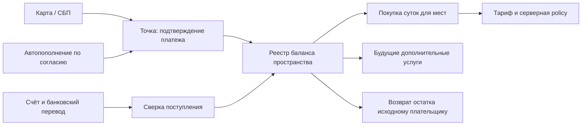

# ADR-0080: Баланс, посуточные места и оплата RU / Global

Дата: 2026-10-09. Статус: **проект v3.0; реальные платежи выключены**.
База исследования: `8fdf1b9d907de88173dd8e6c82950bb75bc082df` (3.0.3).
Ветка: `codex/seat-billing`. План поставок: [balance-billing-v1](../plans/balance-billing-v1.md).

## 1. Решение владельца и границы версии

**Последнее решение владельца 09.10.2026 имеет приоритет над месячной/годовой моделью:**

- У пространства есть денежный баланс. Стоимость действующих мест списывается раз в сутки.
- RU: Team — **6 ₽**, Business — **18 ₽** за человека за полные **24 часа**.
- Global: Team — **$0.10**, Business — **$0.30** за человека за те же 24 часа; Stripe позже.
- Добавление сотрудника сверх уже оплаченных мест сразу оплачивает одни сутки.
- Удаление сотрудника уменьшает следующие списания; схема должна поддерживать будущие допы.
- Пополнить можно **картой, СБП или по счёту**. Автопополнение — необязательная опция.
- Месячных/годовых периодов услуги, обязательной карточной подписки и годовой предоплаты нет.
- Разрешаем отрицательный баланс **в течение 30 суток**. При включённом автопополнении
  пытаемся пополнить **раз в сутки** на сумму «за месяц». Это последнее решение отменяет
  серии 3/24h, карантин 7 дней и промежуточный запрет медиа.

Сохраняются подтверждённые ранее требования: платный человек включает владельца; гости,
боты и непринятые приглашения не оплачиваются; Team/Business; скидки управляются в админке;
покупатели — организации, ИП, совершеннолетние физлица; пропорциональный возврат
неиспользованной оплаты без штрафа; реквизиты ООО «Громтех», АУСН без НДС.

**Отменены этим решением:** фиксирование месячного/годового периода, годовая предоплата,
доплата до конца месяца/года, ставки скидок «за месяц/год», оплата старого периода при
восстановлении. Старый текст ADR v0.2 сохранён в истории Git (релиз 3.0.3).

Цены RU/Global, полные 24 часа и минус до 30 суток подтверждены владельцем. Для
автопополнения «за месяц» трактуем как сумму на **30 суток текущего состава**: это
размер пополнения, не месячный срок услуги. Покрытие накопленного минуса в формуле
автопополнения уточняется в §15; остальные рабочие решения лида обозначены в тексте.

Цель v1 RU: balance ledger, ручное пополнение всеми тремя способами, ежедневные места,
30 дней оплаты услуг в долг, возврат, кабинет, скидки, ограничения, опциональное
автопополнение картой. Global получает отдельный USD каталог и будущий Stripe adapter.
Дополнительные товары получают общий контракт, но сами допы не реализуются. Без денежных займов,
переводов между пользователями/пространствами, вывода на чужие реквизиты, процентов на
остаток, обмена валют, обязательного ежемесячного платежа. Free/manual/self-hosted
не подключаются к платёжной модели автоматически.

## 2. Архитектура

Встраиваем `internal/billing` в существующий Go API. PostgreSQL — источник баланса,
операций, прав на оплаченные сутки и durable jobs. Точка проводит **пополнения/возвраты**;
деньги за место каждый день списывает наш сервер **с внутреннего баланса**, не с карты.
Согласованная оплата мест в минус создаёт задолженность
за услуги, а не выданные клиенту деньги; её нельзя вывести или перевести.
Redis распространяет обновления; финансовая корректность не зависит от Redis-lock.
Отдельный микросервис и новый брокер для v1 не нужны.



Разделяем: billing account, пополнение, банковскую попытку, баланс, списание за услугу,
оплаченный интервал места и доступ. `POST charge` не создаёт место; он только увеличивает
баланс после подтверждения. Положительный остаток сам по себе не разрешает 500 участников:
нужно купить фактически требуемую ёмкость, в пределах аванса либо разрешённой отсрочки. После успешного списания баланс может стать
ровно нулевым — уже оплаченные сутки остаются действительными до конца.

Техническая модель — аванс одного покупателя за услуги одного пространства. Это не
пользовательский платёжный сервис/кошелёк общего назначения. Юридическая квалификация,
фискализация аванса и зачёта подтверждаются перед запуском, не выводятся из названия таблицы.

### 2.1. RU и Global — два каталога, общее ядро

| Market | Currency | Team / 24h | Business / 24h | Provider |
|---|---|---:|---:|---|
| RU | RUB | 6 ₽ (600 коп.) | 18 ₽ (1800 коп.) | Точка, первая интеграция |
| Global | USD | $0.10 (10 cents) | $0.30 (30 cents) | Stripe, последующий этап |

Account имеет неизменяемые в рамках договора `market`, `currency`, `merchant_legal_entity_id`. Выбор не зависит
от языка, IP/VPN или currency в клиентском запросе. Перед покупкой owner явно видит рынок,
продавца и валюту; доступность рынка определяется конфигурацией договора/merchant.
RU и USD не конвертируем и не смешиваем в одном балансе. Переход между рынками — закрытие
долга/возврат старого остатка и отдельный договор/account, без перевода по придуманному курсу.
Цена Global самостоятельная, не результат пересчёта рублёвой по FX. Промо тоже market-specific.

Global нельзя автоматически подключить к ООО «Громтех» или распространить на него обещание
«все данные в РФ»: продавец, налоги, документы, Stripe merchant и обработчики Global пока
не определены. Каталог фиксируем сейчас; активация Global — отдельная поставка после этих
решений. RU документы и платёжные данные не отправляются в Stripe через fallback.

## 3. Интеграция с существующим кодом

| Сейчас | Что меняем |
|---|---|
| `internal/plans/service.go`: `workspace_plans`, `valid_until → free`, cache 30s | Source `manual|billing`; для billing тариф и policy приходят из суточных entitlements, не из старого истечения плана |
| `plans/check.go`, `db/queries/invites.sql`: `KindMembers` включает ботов | Сохраняем жёсткие лимиты; считаем платных людей отдельно |
| `workspaces`, `auth/service.go`, `workspaces/email_invites.go`, `workspaces/roles.go` | Транзакционная покупка/занятие оплаченного места на каждом способе вступления |
| `db/admission.go`, `db/queries/identity.sql` | Billing проверяется внутри существующей границы авторизации и порядка locks |
| `plans/admin.go`: admin plan/suspension | Прямое изменение billing-managed плана запрещено; финансовая приостановка отдельно от модерации |
| `internal/mail`: durable PostgreSQL outbox, TTL 24h, ограничения по адресу | Переиспользуем SMTP; добавляем финансовые шаблоны, дедуп, контроль недоставленных писем |
| `rtc`, `gateway`, `files`, `messages`, `boards`, `recording`, фоновые интеграции | Сквозное применение policy, включая ранее выданные grants и доставку событий |
| `features/workspace/PlanTab.tsx`, `features/admin/AdminWindow.tsx` | Баланс, расход, пополнение и история в существующих экранах; общий UI web/desktop/mobile |

Business остаётся `enterprise` / `PLAN_ENTERPRISE`. `computePermissions` по-прежнему
рассчитывает роли; billing — дополнительное ограничение, не новый источник ролевых прав.
Заменяется §5 ADR-0024 «платёжный провайдер пишет тариф через админский PUT»: оплаченные
права обновляет внутренний сервис транзакционно, без сервисного суперадмин-токена.

Платёжная блокировка не пишет существующий административный `suspended_at`. Оплата не
снимает блокировку модератора и не отключает identity/SSO policy. Ручные старые планы не
превращаются в долги и не требуют баланса до явного перехода владельца.

## 4. Места и суточные интервалы

### 4.1. Кто оплачивается

`active_humans = count(workspace_members JOIN users WHERE role <> 'guest' AND NOT is_bot)`.
Активность означает действующее членство, не presence и не дату последнего входа.
Владелец — один человек; десять устройств не создают десять мест. Один человек в двух
пространствах оплачивается отдельно в каждом. SSO revoke без удаления членства сам по
себе не удаляет сотрудника из расчёта; будущая деактивация требует явного контракта.

Жёсткий лимит тарифа остаётся отдельным: текущие defaults Team 100 / Business 500 участников
с ботами. Покупка мест не отменяет лимит, например 100 людей + 5 ботов не помещаются в Team.
Кабинет различает «людей к оплате» и «всего участников по лимиту тарифа».

### 4.2. Полные 24 часа на место (подтверждено владельцем)

Покупаем **ёмкость пространства**, не несменяемый user_id. `seat_lot` содержит число мест,
план, цену, время `[starts_at, covered_until)` и списание-источник. Покрытие возникает
и при оплате авансом, и при разрешённом начислении в долг; доля paid/receivable хранится
отдельно. Ниже «купленное место» не означает, что денежный долг за него уже погашен. Удаление человека не удаляет
оплаченный lot: до его конца место может занять другой человек без новой платы.

Пример: 10 мест оплачены до завтра 09:00. В 15:00 добавили ещё 2 — сразу списываем стоимость
2 суток, эти места действуют до завтра 15:00. В 18:00 удалили человека, в 20:00 приняли
замену — повторного списания нет. На ближайшем истечении продлеваем только недостающую
ёмкость для оставшихся людей. Удалили всех, кроме владельца — в дальнейшем нужно одно место.

Это «раз в 24 часа для каждого места», а не полная плата при добавлении в 23:59 и ещё одна
в 00:00. Время UTC, сутки = 86400 секунд; локальное время отображается клиентом.
Общего календарного списания в полночь нет; границы объединяются только для одинаковых lots.

На времени `t` сначала заканчиваем lots с `covered_until <= t`, затем считаем:

```text
covered_capacity(t) = сумма действующих купленных мест (авансом или в долг) выбранного плана
required_new_seats = max(0, active_humans(t) - covered_capacity(t))
charge = required_new_seats * effective_daily_unit_price(t)
```

Если достаточно средств **или разрешена оплата мест в долг**, списание и создание lots атомарны. Одинаковое время/цена/источник
группируются в один lot/операцию. Не запускаем отдельный процесс для каждого человека.
При удалении выгодно использовать уже оплаченные дольше живущие места: не продлеваем
истекающие пустые места, пока другой оплаченной ёмкости достаточно.

Если средств не хватает, но account уже активирован и 30-дневное окно ещё открыто,
списываем полный требуемый набор, допускаем отрицательный баланс и создаём lots. В первом
таком списании атомарно открывается debt episode. Не выбираем «неоплаченного сотрудника».
Новые люди также могут входить в этом окне с немедленным суточным начислением; жёсткие
лимиты тарифа продолжают действовать. Owner заранее соглашается с тем, что уполномоченные
администраторы увеличивают расход/долг добавлением людей.

Первая активация требует пополнения как минимум на первые сутки всей команды — рабочее
решение лида против автоматической выдачи 30 бесплатных дней любому новому workspace.
После истечения окна долга нельзя добавить место/создать новый платный lot без восстановления.
Принятое приглашение не должно создавать членство, если покупка/кредитный допуск запрещены.
Создание приглашения не является финансовым событием.

### 4.3. Атомарность и простой scheduler

Вступление/guest→member: обычные права и лимит → billing lock → найти свободное оплаченное
место или купить сутки (с разрешённой отсрочкой при необходимости) → записать членство
и seat event → commit. Любая ошибка откатывает
и добавление, и внутреннее списание. Удаление: записать событие и уменьшить нужду в
следующих продлениях; автоматического возврата остатка суток нет, доступен явный отказ.
Повтор одного join/request_id не вызывает второе списание.

События членства хранят before/after, DB timestamp и sequence; их пишут все пути, включая
signup by invite, email auto-accept, SSO/directory join, бан/выход/смену роли и удаления
аккаунта. Прямой SQL в обход этого контракта запрещён. Проверка покрытия является общей
функцией, а не копией арифметики в каждом handler.

Worker выбирает ближайшие `covered_until` через PG queue; poll ≤1min. Запросы/RTC admission
также вызывают due reconciliation: задержка worker не даёт бесплатный безлимит.
При простое восстанавливаем интервалы по events и price history от последней точки,
не по сегодняшнему COUNT задним числом. На первом уходе в минус открываем episode от исторического времени расхода;
начисляем только до debt deadline. После приостановки новых расходов нет; аварийный простой
worker не даёт начислить 40 суток вместо 30. Catch-up имеет лимит пакета; при большом backlog workspace получает
`BILLING_RECONCILING`, новые расходные действия ждут, сервер не держит гигантскую транзакцию.
Порядок событий с одной timestamp задаёт sequence. Приёмки включают удаление в момент expiry.

## 5. Баланс и денежный реестр

Деньги — currency + `int64` minor units: RUB копейки или USD cents. Суммы банка парсим/формируем decimal без float. Суточная цена
за единицу хранится в minor units, затем умножается на число мест. Не делим цену месяца на
30 каждый раз с накапливающейся ошибкой. Каталог v1: `seat.team.day = 600`,
`seat.business.day = 1800` копеек до скидок в RU; Global — 10/30 cents соответственно. Цена не зависит от длины календарного месяца.

`balance = свободный (не зарезервированный) аванс − неоплаченные начисления за услуги` —
signed величина. `reserved` показывается отдельно; `spendable_cash = max(0, balance)`.
Создание резерва переводит деньги из свободного аванса в reserved и сразу уменьшает balance;
capture не вычитает их второй раз, release возвращает в balance (сначала гасит долг).
Зарезервированный возврат не маскирует уход доступного остатка в минус. Покупка мест может уменьшить balance ниже нуля только
по правилам §8. Возврат и будущие допы **не** используют разрешение местам уходить в минус:
в v1 для них нужен реальный незарезервированный положительный остаток.
Долг не превращается в funding lot, его нельзя вернуть покупателю как деньги.

Реестр append-only, сумма проводок каждого journal entry равна нулю. Минимальные счета:
внешнее поступление/clearing, аванс покупателя, оплаченная ещё неоказанная услуга,
оказанная услуга, дебиторская задолженность за услуги, возврат к выплате. Это технический subledger, не замена бухгалтерского учёта.

| Событие | Результат |
|---|---|
| Подтверждённое пополнение | Погасить старейшую задолженность за услуги, остаток в аванс; сумма ровно равна платежу, источник/fiscal obligation сохраняются |
| Покупка суток | Расходовать аванс, недостающую часть отнести на receivable; создать service lot/entitlement ровно один раз |
| Окончание/оказание услуги | Учесть использование и fiscal settlement согласно подтверждённой схеме |
| Резерв будущего допа/возврата | Перенести из свободного balance в reserved, сумма сохранена, использовать повторно нельзя |
| Отмена резерва | Из reserved обратно в balance, без новой внешней оплаты |
| Подтверждённый возврат | Уменьшить аванс/резерв возврата и связать с исходным пополнением |
| Ошибка/корректировка | Компенсирующая проводка с причиной, исходная запись остаётся |

Cached balance на billing account обновляется в той же транзакции, что journal; периодическая
сверка пересчитывает его из реестра. Пополнение с карты и доступный баланс — разные состояния:
`pending/unknown` не расходуются. Банковская комиссия — расход организации, не второе
уменьшение баланса пользователя. Сверяем gross payment отдельно от net settlement.

Источник каждой денежной единицы сохраняется: `funding_lot` (пополнение) и allocations расходования.
Поступление сначала погашает старейшую задолженность (allocations на service charges),
затем создаёт свободный аванс. Порядок использования положительного аванса — FIFO по подтверждённым пополнениям; возврат неиспользованных
средств привязан к исходному плательщику/инструменту. Одновременные расход/возврат не могут
потратить один остаток дважды. Промобонусы в v1 не вводим; будущие бонусы должны иметь
отдельный невозвратный источник и не смешиваться с настоящими деньгами.

Chargeback/отмена уже зачисленного платежа — отдельный verified dispute и compensating
entry. Не скрываем недостачу обнулением ledger. Автоматический расход и возвраты account
блокируются до разбора; такой dispute не считается обычным разрешённым кредитом за места.

## 6. Пополнение: карта, СБП, счёт

### 6.1. Общий контракт

Owner выбирает сумму и метод. Создаём `funding_intent` с account, payer snapshot, account currency и amount,
request_id и purpose. Внешний запрос вне DB-транзакции. Успех — подтверждённая денежная
операция банка, сопоставленная с intent; redirect/кнопка «Я оплатил»/загруженная платёжка
денег не зачисляют. Повтор события из webhook/polling/выписки даёт одно зачисление.

Баланс не закрепляет навсегда текущий тариф: внесённые 1 000 ₽ остаются 1 000 ₽, а расход
идёт по объявленной действующей цене услуги. Минимум/максимум ручного пополнения задаётся
продуктовой конфигурацией в пределах подтверждённых ограничений провайдера.
Оплата приостановленного пространства доступна owner; billing login не обходит identity.

### 6.2. Карта и СБП

Ручное пополнение — hosted payment банка с разрешёнными методами card/sbp. Реквизиты
карты не проходят Calab. Доступность метода зависит от подключённого merchant.
Платёжная ссылка/QR в UI хранится как состояние intent; frontend не доверяет query-параметру
`success`. Не подключаем recurring при обычной оплате картой и не трактуем СБП как согласие
на будущие списания. СБП автосписания не входят в v1.

Не более одного активного acquiring checkout на account; повтор возвращает существующий
intent. Новый создаётся после подтверждённого expiry/cancel/terminal. `quote` TTL нашего
интерфейса не отменяет банковскую ссылку. Поздняя реальная оплата учитывается как пополнение
своего account, не пропадает; если account закрыт — очередь возврата. Нельзя начислить её
в чужое пространство, выбранное пользователем уже после создания ссылки.

### 6.3. Счёт и перевод

Счёт — **счёт на пополнение аванса**, не обещание оплаченного года или N сотрудников.
Для B2B собираем наименование, ИНН, КПП при наличии, адрес/контакт; собственные расчётный
счёт/БИК и реквизиты получателя берём из merchant config. Не выводим их из ИНН или примера
банковской документации. Счёт имеет уникальный номер/reference и неизменяемую сумму.
PDF и банковский documentId доступны owner, отправка на email — по его явному действию.

Зачисление привязывается к **входящему переводу с уникальным bank payment id**, а не только
к статусу «счёт оплачен». `Get Invoice Payment Status` — сигнал для сверки, не вторая
денежная операция. Принять частичную оплату можно: зачисляем реально пришедшую сумму,
счёт показывает paid_amount/остаток. Переплата того же идентифицированного покупателя
идёт в аванс и отображается отдельно; неоднозначный плательщик/назначение — разбор.

Одинаковая сумма от одного ИНН не является ключом: два пространства могут оплатить одинаково.
Автосопоставление требует точной reference и проверенного плательщика/счёта. Неизвестный
перевод попадает в suspense; оператор сопоставляет с доказательством и аудитом. Перевод
третьего лица — ручное подтверждение основания, без молчаливой смены стороны договора.

Для overdue/expired invoice поздние деньги всё равно учитываются по факту поступления;
истечение срока документа не уничтожает платёж. Выставление счёта, даже с подписью,
не увеличивает available и не включает платный доступ до получения денег.

**Защита от двойного пополнения:** зачисление эквайринга/СБП на расчётный счёт ООО — settlement
уже учтённых платежей, не новое пополнение пользователя. Банковский импорт различает
direct invoice transfers и settlements провайдера. Источники и uniqueness перекрываются
между webhook, status poll и выпиской; отсутствие уникального ID — ручная сверка, не
дедуп по сумме/дате. Права API на выписки минимальны, исходящие переводы не нужны для v1.

## 7. Автопополнение — отдельная опция, попытка раз в сутки

По умолчанию выключено. Owner отдельно принимает recurring consent с формулой суммы,
периодичностью и `max_auto_topup_minor`. Обычная карта/СБП/счёт не включают auto-topup.
Сохранённая карта сама по себе также не является согласием. При подключении возможен
первый hosted платёж с явным подтверждением суммы; он полностью учитывается на балансе.

Правило владельца — пополняем «на месяц». Размер запаса на 30 суток:

```text
N = max(1, active_humans at dispatch)
reserve_30d = 30 * N * effective_daily_unit_price(current_plan, dispatch_time)
proposed_A = max(0, -balance) + reserve_30d
```

Включение долга в `A` — предложение, отдельно заданное владельцу; до ответа не считаем
его утверждённым разрешением на боевой charge. Альтернатива — всегда `A=reserve_30d`.
Пример без скидок: 10 Team RU → запас 1 800 ₽; при долге 120 ₽ proposed_A=1 920 ₽.
10 Team Global → $30; 10 Business Global → $90. Пополнение не закрепляет цену или состав
на 30 дней и не сгорает в конце месяца. Допы не увеличивают reserve_30d автоматически.

Триггер: ближайшее списание мест превысит доступный аванс или баланс уже отрицательный.
Покупка суток не ждёт банк: при разрешённой отсрочке начисление проходит локально.
Auto job сразу пробует один раз; после подтверждённого отказа следующая новая попытка
не раньше чем через **24 часа**. В сутках после принятого dispatch второго charge нет;
не используем полуночные календарные квоты. Попытки продолжаются при долге, активном
согласии и неприостановленном тарифе, до окончания 30-дневного окна; 3h/24h серии удалены.
После `suspended` новые фоновые попытки останавливаются, owner платит явно через кабинет.

Перед каждой новой попыткой пересчитываем N/цену/долг/согласие/лимит, фиксируем snapshot.
В already-sent/unknown сумму не меняем. Рост выше `max_auto_topup_minor` требует явного
подтверждения владельца; приглашение сотрудников не расширяет лимит карты. После успешного
автопополнения новый автоматический charge также не раньше 24h. Малый остаток/дорогой доп
не создаёт каскад пополнений. Неуведомлённое повышение цены — confirmation, не bank decline.

Unknown блокирует следующий автоматический POST до безопасной сверки независимо от
прошедших 24h. HTTP retry выключен там, где банк не гарантирует idempotency. Owner может
пополнить вручную другим методом, понимая возможность позднего auto-success; обе реальные
оплаты учитываются, излишек можно вернуть. Письмо после каждого настоящего отказа, отдельное
операционное уведомление при неопределённом результате; «недостаточно средств» не угадываем.

Отзыв auto-topup блокирует будущие dispatch, включая ежедневные повторы, но **не** прекращает
суточный расход баланса/долга за включённый тариф. «Отключить автопополнение» и «Остановить
платный тариф» — разные действия. Отзыв через support фиксирует время получения; старая
карта не заменяется новым mandate без нового согласия. Возможность привязки без платежа
зависит от провайдера; не списываем проверочный 1 ₽ по собственной инициативе.

## 8. Отрицательный баланс: 30 суток, затем приостановка

**Последнее решение владельца заменяет старую схему:** нет бесплатного grace, четырёх/трёх
попыток, карантина и промежуточного отключения медиа на 7-й день. Услуги продолжают
начисляться по суточной цене, balance может быть отрицательным. Карта не обязательна;
одинаковая policy для card/SBP/invoice и будущего Stripe.

В первой транзакции, которая делает balance<0, сохраняем `negative_since` и
`suspend_at = negative_since + 30 * 86400 seconds`. Пока время меньше suspend_at,
действуют обычные возможности выбранного тарифа, допускается оплачиваемое в долг
добавление людей в пределах лимитов. Срок не зависит от числа ошибок банка.

Частичное пополнение, смена карты/метода/тарифа/owner, новый invoice, удаление участника,
рестарт scheduler и очередное начисление не сдвигают `negative_since`. Пополнение сначала
гасит старейшие начисления. Episode закрывается, когда **после применения всех расходов,
которые уже наступили**, balance>=0. Если следующий расход снова делает минус — это новый
episode, только потому что предыдущий долг реально был погашен. 1 ₽ при долге 100 ₽ ничего
не обнуляет. Удаление людей уменьшает будущие расходы, но не отменяет оказанную услугу.

Ровно на `suspend_at` при оставшемся минусе: workspace закрывается, новые начисления и
авто-topups прекращаются. Owner — paywall с тремя способами погашения, историей и support;
сотрудники — «Пространство приостановлено. Обратитесь к владельцу». Нет начисления за
время приостановки. Короткая задержка worker не продлевает окно: gate считает deadline
из DB времени и before-action catch-up.

Покупка последних суток внутри окна обрезается по `suspend_at`, если полный день вышел
бы за границу: стоимость пропорциональна секундам, округление half-up до minor unit.
Это единственное техническое исключение к полным суткам помимо смены/остановки тарифа:
не выставляем счёт за часы, на которые сами закроем доступ. При погашении до дедлайна
короткий lot заканчивается по своей дате, потом покупаются полные 24h.

Восстановление suspended: погасить старый долг и оплатить первые новые сутки всей команды.
Одна котировка показывает обе строки. Одного выхода balance в ноль недостаточно для
повторного открытия 30 дней без оплаты первого дня после suspension. Начало новых суток —
момент восстановления, без начисления за перерыв. Если сумма меньше recovery quote,
долг уменьшается, пространство остаётся suspended. Добровольный stop не списывает долг.

| State | Условие / поведение |
|---|---|
| `funded` | Нет отрицательного остатка, покрытие мест действует |
| `low_balance` | Прогноз следующего расхода выше аванса, предупреждение/auto-topup при включении |
| `in_arrears` | Balance<0 и время до suspend_at; сервис работает, суточные расходы продолжаются |
| `suspended` | Минус не покрыт за 30 суток; workspace закрыт, расходы остановлены |
| `stopped` | Добровольно выключен платный тариф; новые расходы прекращены, долг сохраняется |

Во время bank outage/unknown существующий баланс и факты услуг не меняются. Operator может
выдать краткий incident hold на **применение блокировки**, с причиной/сроком/alarm, если
подтверждается проблема обработки уже полученных денег. Дедлайн и ledger не переписываются;
за продлённый оператором бесплатный доступ сверх suspend_at новые долги не начисляются.
Такой hold не создаётся автоматически после каждого timeout и не разрешает retry charge.

## 9. Скидки, смена тарифа, отказ и возврат

### Скидки

Скидка применяется **к внутренней покупке суток/допа**, а не к банковскому пополнению.
1 000 ₽ пополнения дают 1 000 ₽ баланса. Иначе получились бы две скидки или расход по
непонятному курсу. Месячная/годовая скидки 10/20% не переносятся автоматически.

Админ задаёт SKU/plan, bps, интервал `[starts_at, ends_at)`, reason; активные версии не
пересекаются, редактирования задним числом нет. Суточная цена после скидки округляется
half-up до **minor unit за единицу**, затем умножается на места. Изменение скидки не меняет
уже купленные сутки и balance. Snapshot сохраняет catalogue/discount version и цену.
Повышение суточной цены/окончание скидки доводим заранее, как требует действующая
редакция договора; проект сохраняет предупреждение за 10 дней либо явное подтверждение.
Если уведомления нет, новые сутки по более высокой цене не покупаем автоматически:
требуется подтверждение, не «ошибка платежа». Купленные интервалы сохраняются;
когда их покрытия недостаточно для всей команды, тариф останавливается с переходом
на Free и пропорциональной компенсацией остатка по процедуре stop. Если уже есть долг,
его deadline остаётся; неуведомлённая новая цена не создаёт дополнительные начисления.

### Смена плана и остановка расхода

`subscription` — выбранный план и согласие на суточные начисления, включая 30-дневную
отсрочку, не календарный период. Рабочее решение v1: «Остановить платный тариф» немедленно
выключает auto-topup/renewals и переводит на Free; неиспользованная часть текущих lots
пропорционально компенсируется на баланс с сохранением источника денег, затем можно
запросить внешний возврат положительного остатка. Непогашенная оказанная услуга остаётся
долгом. Deadline долга продолжает действовать и на Free: stop не переносит его и не
снимает наступившую suspension. Новый paid запуск при
незакрытом episode сохраняет прежний deadline. Выход из приложения не является отменой.

Предложение v1: смена плана назначается на ближайшую общую границу завершения уже оплаченных
lots (не более 24h при rolling модели). До неё новые/продлеваемые интервалы обрезаются
по этой границе с пропорциональной ценой. На границе единым списанием оплачиваем полный
день всех людей по новому плану. Возврат/двойное списание старых суток не нужны. Если новый
план несовместим с лимитами/identity grants — 409 до подтверждения; если на переход не
хватило средств — разрешённая отсрочка либо suspension по исходному deadline, не скрытая покупка прежнего тарифа за новый полный день.
Точные пропорциональные суммы показываем в quote. Немедленный upgrade вне v1.

Передача owner отзывает consent на автооплату прежней карты. Баланс принадлежит стороне
договора, не личному user_id владельца. При смене уполномоченного представителя того же
покупателя история и balance сохраняются; смена покупателя/юрлица — прекращение/возврат
и новый account, автоматического перевода средств другой стороне нет.

### Возврат

Возвращаем положительный неиспользованный денежный остаток после расчёта оказанных услуг на исходный инструмент/счёт плательщика;
доступна отдельная заявка на прекращение ещё неиспользованной части оплаченных суток.
Пропорция: цена купленного lot × оставшиеся секунды / секунды lot, half-up до
minor unit. Для неоплаченной части это уменьшение receivable, не выплата денег клиенту;
для оплаченной — возврат в аванс исходного funding lot и по заявлению наружу. Внешний
возврат никогда не превышает фактически полученные деньги минус уже возвращённое. При уменьшении ёмкости должны оставаться места
для текущих участников либо явно оформляется прекращение платной услуги целиком.
Удаление сотрудника само по себе — отмена будущего renewal, не автоматический банковский refund.

Запрос резерва возврата немедленно убирает сумму из balance в reserved; ежедневный job не может её
потратить. Проверенный refund уменьшает ledger; failure/reject возвращает резерв или
остаётся в обработке согласно фактическому результату банка, не «успех» по нажатию оператора.
Возврат через оператора в v1 поддерживает карту/СБП/счёт; автоматизация подключается только
для подтверждённых API. Срок по опубликованной оферте — не позднее 10 календарных дней.
Частичные возвраты связываются с funding lots, комиссия/штраф сверху не удерживаются.

## 10. Данные и транзакции

| Таблица | Инвариант / назначение |
|---|---|
| `billing_accounts` | один active account на workspace (partial UNIQUE), payer snapshot, market/currency/merchant, revision, signed cached balance; survives workspace deletion |
| `billing_subscriptions` | account UNIQUE, selected plan, enabled, policy version, scheduled change; без month/year |
| `billing_prices`, `billing_discounts` | SKU и версия дневной цены/акции; immutable history |
| `billing_journals`, `billing_postings` | balanced append-only ledger; UNIQUE business event key |
| `billing_funding_lots`, `billing_allocations` | источник денег/его использование/возвращаемый остаток |
| `billing_reservations` | pending add-on/refund, expiry, capture/release ровно один раз |
| `billing_seat_lots`, `billing_seat_events` | купленные интервалы/ёмкость, paid/receivable allocations, member sequence, источник renewal/admission |
| `billing_service_charges` | SKU, quantity, interval, price snapshot, journal id; UNIQUE source+interval |
| `billing_funding_intents`, `billing_bank_attempts` | request_id/body hash, amount/method, immutable dispatch, pending/unknown/final outcome |
| `billing_bank_transactions` | provider+merchant/account+canonical external payment id UNIQUE; origin acquiring/direct_transfer/settlement |
| `billing_invoices` | account, number/reference UNIQUE, bank document id, payer, requested/paid amount, PDF/status |
| `billing_mandates`, `billing_consents`, `billing_autotopup_settings` | разрешение только для auto-topup, masked card, формула 30 дней/денежный предел, version/revocation |
| `billing_funding_episodes` | negative_since, suspend_at, daily bank attempt timestamps, recovery evidence; один открытый episode на account |
| `billing_refunds`, `billing_receipts` | status/id/amount/source/deadline; отдельно от подтверждения оплаты |
| `billing_provider_events`, `billing_jobs`, `billing_outbox`, `billing_audit` | durable inbox, leases, side effects, actor/reason |

Это контракт сущностей; конкретные migration numbers и proto field numbers назначаются
на этапе схемы из актуального main. Внутри account обязательна проверка принадлежности
всех объектов (lot, intent, refund, invoice). История оплаты не удаляется через cascade
при удалении workspace/user; PII retention/доступ соответствует политике и учётным срокам.

Порядок locks согласуется с identity: workspace boundary сначала, режим exclusive для
финансово значимого членства выбирается до shared locks; дальше account/subscription,
затем lots/balance/attempt. Не брать workspace lock после account lock. Существующий
members advisory-lock сохраняется внутри этой границы. Нет HTTP/SMTP/SFU внутри DB tx.

Внутреннее списание: unique event key → lock account → проверить balance/отсрочку/цену →
journal+allocations+entitlement+cached balance+policy revision+outbox → commit.
Внешнее пополнение: verified bank transaction → такой же lock → unique credit → outbox;
затем отдельный idempotent ensure-coverage job. Сбой после зачисления не повторяет credit.
Операции с pending/unknown bank attempt не зачисляют аванс заранее.

## 11. Точка: adapter, безопасность и сверка

### Подтверждённая поверхность API

Источник — [официальная документация](https://developers.tochka.com/llms-full.txt), снимок,
прочитанный 09.10.2026. Повторное открытие части страниц дало 502/TLS error; неподтверждённых
гарантий не добавляем. Схему каждого используемого метода фиксируем fixtures на P2.

| Задача | API / ограничение |
|---|---|
| Ручная карта/СБП | [Create Payment Operation With Receipt](https://developers.tochka.com/docs/tochka-api/api/create-payment-operation-with-receipt-acquiring-v-1-0-payments-with-receipt-post), paymentMode; налоговый/авансовый mapping требует подтверждения |
| Выставить счёт | [Create Invoice](https://developers.tochka.com/docs/tochka-api/api/create-invoice-invoice-v-1-0-bills-post) → documentId; Get Invoice → PDF |
| Сигнал оплаты счёта | [Get Invoice Payment Status](https://developers.tochka.com/docs/tochka-api/api/get-invoice-payment-status-invoice-v-1-0-bills-customer-code-document-id-payment-status-get); подтверждение суммы/поступлений через выписку |
| Прямой перевод | [incomingPayment](https://developers.tochka.com/docs/tochka-api/opisanie-metodov/vebhuki/incomingPayment), [Get Statement](https://developers.tochka.com/docs/tochka-api/api/get-statement-open-banking-v-1-0-accounts-account-id-statements-statement-id-get); сверять уникальную денежную операцию |
| Автопополнение картой | [Подписка без графика](https://developers.tochka.com/docs/tochka-api/opisanie-metodov/podpiski-rekurrentnye-platezhi/rabota-s-podpiskami-bez-grafika-spisania): recurring:true, без Options/saveCard:true |
| Повторный charge | [Charge Subscription](https://developers.tochka.com/docs/tochka-api/api/charge-subscription-acquiring-v-1-0-subscriptions-operation-id-charge-post): operationId+amount, ответ boolean; нет заявленного attempt id/idempotency key |
| Проверка платежа | Get Payment Operation Info содержит Order[].orderId/type/amount/time; связь recurrent попыток ещё подтвердить |
| Возврат | Общий Refund Payment Operation есть для ссылок; возврат recurring документация относит к интернет-банку, методы не смешиваем |

`customerCode` — код ООО как клиента банка, не user_id Calab. `paymentLinkId` несёт
уникальную reference intent в пределах разрешённого формата. Subscription operationId,
order/payment id и наш attempt_id — разные поля. Банк не выбирает plan/seat count.

Adapter: CreatePayment, GetPayment, CreateInvoice, GetInvoice, ListIncomingPayments,
CreateMandate, ChargeMandate, CancelMandate, Reconcile, Refund(capability).
Capabilities явно ограничивают cancel/expiry/partial refund/bind without charge. Никаких
«универсальных» методов, обещающих неподдержанное действие. Sandbox и production credentials
и base URLs разделены, исходящие bank transfers в v1 только оператором.

### Неизвестный исход и идемпотентность

Bank attempt: `prepared → dispatching → pending|unknown|failed|succeeded`.
Одна активная попытка auto-topup на account. Dispatch фиксируется до отправки. Потеря
ответа/lease после dispatch = unknown, **не** повтор charge. HTTP retries POST выключены.
Локальный request_id не является банковской идемпотентностью. Каждое подтверждённое
внешнее движение зачисляется только один раз по canonical external id.

Разрешены reconciliation и ручная оплата независимым способом, но UI предупреждает,
что неизвестный auto-topup ещё может завершиться. Для повторного **автоматического**
charge unknown должен быть однозначно разрешён. Сумма+время не достаточны для связи
повторяющихся платежей. Поздний success зачисляем, не теряем из-за старого failed UI.
Нет безопасной корреляции у банка — автоопция остаётся выключенной; ручные методы
могут запускаться отдельно после собственной проверки.

Webhook: bounded body, RS256 JWT, доверенный ключ и контролируемая ротация, не URL ключа
из запроса. Проверять только реально гарантированные claims, merchant/customer/id/amount,
payment type; RUB подтверждается контрактом, если в событии нет currency. APPROVED —
оплата, AUTHORIZED/redirect/boolean — не деньги. Верный webhook сначала в durable inbox,
потом ACK; неверная подпись отвергается. Неизвестная reference — inbox review без credit.
Dedup по операции и событию, не одному hash JWT. Подписанный replay не повторяет проводку.

Consent/version/лимит auto-topup проверяется непосредственно на dispatch под lock.
Отзыв блокирует новые отправки, уже отправленное сверяется/возвращается при необходимости.
Секреты/tokenCardId шифруются, frontend получает только masked card. TLS validation не
выключается, webhook payload и платёжные URL не печатаются в логи.

### 11.1. Global / Stripe (следующий этап, не реализация v1 RU)

Тот же ledger и daily entitlements работают в USD, provider выбирается account market.
Stripe Checkout/PaymentIntent пополняет баланс; для off-session сохраняем средство оплаты
через явно согласованный setup flow, а не создаём месячную Stripe Subscription для мест.
Авторитетен подтверждённый payment success; `requires_action` возвращает owner в hosted
flow, не считается ни деньгами, ни разрешением повторять без аутентификации.

У Stripe есть [idempotency keys](https://docs.stripe.com/api/idempotent_requests), но ключ
может быть удалён после 24h: локальные payment IDs/reconciliation нужны и здесь. Один
attempt = один PaymentIntent/idempotency key; нельзя спустя сутки создать вторую оплату
неразрешённого intent. [Webhook](https://docs.stripe.com/webhooks) проверяет подпись по
raw body; события могут повторяться/идти не по порядку, ledger применяет денежное движение
один раз. [Setup flow](https://docs.stripe.com/payments/save-and-reuse) и конкретный набор
методов уточняются для выбранного merchant; не обещаем СБП через Stripe.

До Global нужны merchant/юридическое лицо, страны/налоги, Global terms/privacy, доступные
валюты и способы оплаты/возврата, отдельный sandbox и live pilot. Настройки/ключи/webhook
RU и Global раздельны; российские документы и реквизиты не копируются в Global автоматически.

## 12. Policy: нельзя обойти старым клиентом

Общий server admission проверяет billing поверх ролей и лимитов. Граница workspace берётся
из настоящего ресурса room/file/task, а не из клиентского параметра. Deadlines вычисляются
по DB time при запросе, не только по часовой задаче. Unknown новый маршрут обязан получить
классификацию в таблице по аналогии с `botroutes.go`/`identityroutes.go`.

| Поверхность | In arrears (до 30d) | Suspended |
|---|---|---|
| Текст/реакции/голос/камера/экран | Обычные permissions и лимиты, без 7-дневного запрета | Запрет; отключить RTC и повторный вход |
| Файлы/задачи/календари | Обычные permissions; самостоятельные допы требуют положительного остатка | Чтение/запись workspace данных запрещены |
| Guests/public forms/links/apps/SIP/integration jobs | Обычные permissions | Остановить workspace доступ, экспорт/доставку данных |
| Owner billing/refund/stop/support/switch workspace | Доступно | Доступно в минимальном recovery scope |

Проверять gateway READY/RESUME/replay, поиск/экспорты, notification/push previews, ботов,
уже загруженный file_id, stickers/inline images, запись встречи, публичные ссылки. Billing
suspension скрывает локальный UI cache этого workspace, не стирая другие пространства;
уже скачанное технически отозвать невозможно. Presigned URLs требуют короткого срока/
authenticated origin, окно отзыва измеряется в security acceptance.

Outbox + Redis инвалидируют policy, gateway и plan cache. RTC reconciler меняет SFU grants,
не только удаляет track (иначе старый токен опубликует его заново). REST запрет с commit/
дедлайна; цель распространения RTC/WS ≤30s при здоровой инфраструктуре. Просроченный cache
не даёт бессрочный доступ. Ошибка DB = временный отказ чувствительного действия, не Free.

Глобальные DM не принадлежат workspace и остаются доступны; чужие пространства не затронуты.
Общие льготы CalDAV/музыкального режима не должны считаться от suspended workspace, но
другая действующая подписка пользователя может их сохранять. Это граница продукта,
не обещание выключить вообще весь аккаунт за недостаток средств одного пространства.

## 13. API, интерфейс, чеки и уведомления

Новые proto — `proto/calaba/v1/billing.proto`, additive workspace billing summary/event;
generated в commit. Amount int64 minor units, currency account; суммы услуг клиент не назначает.

| Метод `/api/workspaces/{id}/billing` | Назначение |
|---|---|
| `GET /` | Owner: signed balance/spendable/reserved/debt, selected plan, суточная цена/скидка, люди/покрытие, расход и forecast, episode; остальным нефинансовый summary |
| `POST /activate`, `POST /stop`, `POST /schedule-change` | quote_id, request_id, expected_revision; явное начало/остановка расхода |
| `POST /quote` | purpose activation/seats/change/refund → расчёт/версии/TTL; сумма не принимается как истина |
| `POST /topups` | amount, method card/sbp, request_id, payer profile → intent/hosted URL |
| `POST /invoices` | amount, payer profile, request_id → invoice/reference/PDF/status |
| `GET /funding/{id}` | Статус банковского intent без выдачи секретов |
| `PUT /auto-topup`, `DELETE /auto-topup` | формула 30 дней/max amount/consent или немедленный отзыв; метод опционален |
| `GET /ledger`, `GET /payments`, `GET /invoices` | Курсорная история пополнений, расходов по дням/SKU/валюте, возвратов и чеков |
| `POST /refund-requests`, `GET /refund-requests` | Возврат остатка/отказ от неиспользованных услуг, статус и сроки |

Управление деньгами — только owner, обычные auth/identity/step-up и защита CSRF где нужны;
MANAGE_WORKSPACE, guest, bot, integration token не дают доступа к карте/балансу.
Авторизованный администратор может добавлять людей и тем самым тратить баланс на места:
владелец принимает это при включении платного тарифа; операция записывает реального actor.
Новая платная категория допов требует своего разрешения/лимита, не наследует автоматически
право списывать баланс из разрешения отправлять сообщения.

Superadmin `/api/admin/billing`: версии цен/акций, bank reconciliation, invoice matching,
refunds, incident hold/корректировки; reason+revision+request_id+audit. Кнопка «зачислить»
без доказанного поступления запрещена; компенсация за услугу имеет отдельный тип операции.
Webhook `/api/billing/tochka/webhook` вне user auth, но только через signature/inbox.

409: `BILLING_INSUFFICIENT_FUNDS`, `BILLING_QUOTE_EXPIRED`, `BILLING_REVISION_CONFLICT`,
`BILLING_RECONCILING`, `BILLING_PAYMENT_PENDING`, `BILLING_PAYMENT_UNKNOWN`,
`BILLING_CHANGE_INCOMPATIBLE`, `BILLING_PRICE_CONFIRMATION_REQUIRED`.
403: `BILLING_OWNER_REQUIRED`, `WORKSPACE_BILLING_SUSPENDED`.
503: provider unavailable; 422 validation; 429 rate limit. Повтор request_id с другим body — 409.

Кабинет показывает balance в валюте account, зарезервированные суммы, «примерно на N дней» с явной
пометкой прогноза при текущем составе/цене, ближайшие списания и историю. «Пополнить» содержит
три способа; auto-topup отдельный выключенный переключатель. «Отключить автопополнение»
и «Остановить платный тариф» — разные действия. Paywall owner оставляет все способы оплаты;
сотрудник видит заглушку без сумм/карты. Desktop/mobile hosted checkout — системный браузер
и возврат к статусу intent, не обработка карты в renderer.

**Чеки:** пополнение аванса и зачёт аванса за услуги — разные хозяйственные события.
ФНС описывает необходимость учитывать оба вида расчёта ([разъяснение](https://www.nalog.gov.ru/rn39/ifns/imns39_02/info/14975216/),
[FAQ](https://kkt-online.nalog.ru/faq/)). Поэтому одного чека банка на topup недостаточно для
проектирования всей схемы. Создаём отдельные fiscal obligations advance/service/postpayment/refund; услуга в минус и погашение долга имеют отдельный fiscal mapping.
Момент и допустимая группировка зачёта, АУСН/taxSystemCode/без НДС, B2B особенности и
фискальный партнёр — launch gate. Не обещаем один месячный чек без подтверждённого основания.
Услуга/суточный lot и факт её окончания сохраняются, чтобы можно было корректно оформить
зачёт. Ошибка чека не повторяет внешний платёж и не зачисляет баланс второй раз.

`billing_outbox` → существующий `mail_outbox` с unique business key и связанным mail id.
Финансовые письма не конкурируют с лимитом 3/час для кодов входа; TTL 24h обычной почты
не должен молча стирать финансовое событие: failure+alert+повторная доставка по policy.
SMTP exactly-once не обещаем, ledger exactly-once относительно business id обеспечиваем.
Письма: пополнение, нехватка/прогноз, каждый реальный отказ автооплаты, ограничения/
восстановление, отмена/смена цены, возврат. Каждое внутреннее суточное списание доступно
в истории; email о нём — настраиваемая сводка, не обязательное письмо на каждого сотрудника.
Ссылка ведёт в authenticated кабинет, финансовые данные не отправляются сотрудникам.

## 14. Допы, rollout и эксплуатация

Каталог расширяется SKU (`seat.team.day`, `seat.business.day`, будущие add-ons). Общий
контракт: quote → reserve (если асинхронная услуга) → capture или release, event key,
price version, quantity, actor/scope, возможность refund. Дневные места оплачиваются
синхронно сразу; дорогой асинхронный доп сначала резервирует максимальную согласованную
сумму, затем списывает фактическую ≤резерва. Нельзя запустить доп без согласия и потом
безлимитно списать по «фактическому потреблению». Перечень допов/цены вне этой реализации.

Flags: `BILLING_MANUAL_TOPUP_ENABLED`, `BILLING_INVOICE_ENABLED`,
`BILLING_AUTO_TOPUP_ENABLED`, `BILLING_SERVICE_DEBITS_ENABLED`, `BILLING_ENFORCEMENT_ENABLED`.
Все false по умолчанию. При kill switch новые операции запрещены, inbox/reconciliation/
возвраты/read API продолжают работать. Отключение автоматического пополнения не отключает
списание услуг; выключение debit/enforcement — отдельный аварийный incident с аудитом.

Rollout: additive schema → ledger/property tests → ручные topups/invoices в sandbox →
суточные места/долг/policy → UI/admin → shadow без денег/ограничений → allowlist pilot → новые
покупки; auto-topup может выйти позднее после bank gates. Старые manual планы не меняются.
Старый binary без billing awareness после включения не выкатывается: иначе станет обходом
policy. При откате выключаем writers совместимой версией, не удаляем ledger/документы.

Публичная оферта и цены 3.0.3 сейчас описывают месячную/годовую модель. **До запуска баланса
нужна новая согласованная редакция**: аванс, сутки/граница, цена/скидки, три способа пополнения,
необязательный recurring, расход после отключения auto-topup, отсрочка 30 дней/приостановка, возврат остатка/услуг,
фискализация и данные банка. Архив прежнего принятия сохраняется. Этот ADR не публикует
новые юридические условия молча и не включает платежи.

Метрики: due job lag, debit-after-suspension violation, ledger/cache mismatch, double credit,
unknown age/count, orphan transfers, invoice reconciliation lag, amount gross/net mismatch,
refund deadlines, fiscal/mail backlog, policy/RTC lag. Суточная сверка bank→ledger и ledger→bank
по идентификаторам/суммам, включая partial refunds и settlement. Алармы на unknown>15min,
policy lag>30s, несошедшийся реестр и просроченные возвраты. Никаких секретов в логах.

## 15. Решения и оставшиеся внешние проверки

### Продуктовые параметры

Подтверждены: RU 6/18 ₽, Global $0.10/$0.30, полные 24h на место, optional auto-topup,
разрешённый минус 30 суток, попытка auto-topup раз в сутки. Старые месяцы/годы,
3h/24h серии, карантин и restricted stage отменены последним решением владельца.

Рабочие решения лида: «месяц» в размере пополнения = 30 суток текущего состава, начальная
суточная скидка 0% (старые 10/20% не переносятся), первая активация/recovery после suspension
требуют оплаты первого дня, допы не используют отсрочку мест, Global provider отдельным этапом.

Открытый вопрос владельцу: размер auto-topup только reserve_30d или долг+reserve_30d;
в документе предложен второй вариант. До ответа не включать автоматический charge.

### Банковские/операционные gates

- Merchant для card/sbp, корректные реквизиты счёта ООО; права на invoices/выписки/webhook,
  тестовый контур, минимумы/максимумы сумм и rate limits. Секреты в чат не присылать.
- Идентичность платежа во всех источниках, distinction direct transfer/settlement,
  partial/overpayment и late arrival; доказанная сверка без двойного credit.
- Optional recurring: корреляция каждой операции при одинаковых суммах, безопасная
  сверка timeout, реальные decline/time, отмена/смена mandate. Boolean сам по себе недостаточен.
- Фискальный партнёр: аванс/зачёт/refund, переменные суммы/частичные возвраты, режим АУСН.
- Возвраты карты/СБП/банковского перевода и полномочия оператора, подтверждение исполнения.

Незакрытый gate auto-topup не мешает реализации ledger и ручных методов; запуск конкретного
метода требует его собственных подтверждений. Security/protocol reviews требуются перед
реальными деньгами/ограничениями. Сейчас владелец запретил субагентов; ADR и реализация
готовятся лидом, независимые ревью остаются отдельным gate будущего включения.
